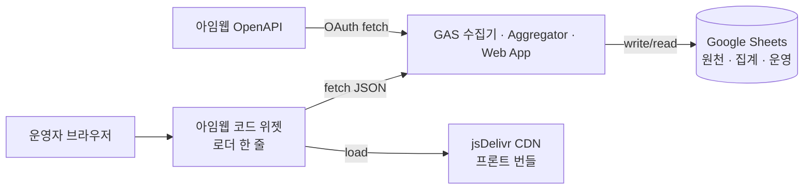

# 솔패스 대시보드 (Solpath Academy Dashboard)

> 아임웹 기반 온라인 학원의 회원·매출·재등록을 한 화면에서 관리하는 **내부용 운영 대시보드**.  
> 1인 운영 환경을 위해 **애자일** 방식으로 빠르게 가치를 만들어가는 실전 1인 개발 프로젝트.

## 배경

- 아임웹 쇼핑몰로 운영되는 온라인 학원에서 회원/주문/수강 데이터가 **아임웹 관리자 · Google Sheets 상담DB · 수기 수강 장부**에 분산되어 있음
- 매달 재등록 시점 관리가 핵심 KPI인데, 기존 Excel 리포트는 **수작업**이라 자동화 여지가 크다
- 업체 외주 대신 **내부 툴을 직접 제작**해 운영 자산으로 보유 + 사용자 피드백 즉시 반영 가능한 구조로

## 목적

1. 흩어진 데이터를 한 대시보드에서 통합 조회
2. 재등록 대상자를 **놓치지 않게** 자동 추출 + 연락 상태 추적
3. 매출·인원·리텐션·이탈 위험 등 운영 의사결정용 지표 자동 집계
4. 모든 데이터를 Google Sheets에 축적해 **외부 BI 도구(Looker Studio 등) 확장 여지** 확보

## 기술 스택

| 레이어 | 기술 | 선택 이유 |
|---|---|---|
| Data Source | 아임웹 OpenAPI v2 | 기 운영 플랫폼, SSOT |
| Backend | Google Apps Script (GAS) | 무료, Sheets 네이티브, 서버 인프라 0 |
| Storage | Google Sheets | 운영자가 직접 열람 가능, SSOT, Looker 호환 |
| Frontend | Vanilla JS + Chart.js | 빌드 파이프라인 불필요, 위젯 임베드 쉬움 |
| Hosting | GitHub Pages + jsDelivr CDN | 무료, Public 레포 한 번에 배포 |
| Embed | 아임웹 코드 위젯 | 기존 로그인 상태 활용, 별도 인증 시스템 불필요 |
| Notification | Email (Phase 1) → Kakao 알림톡 (Phase 6) | 무료 범위 최대 활용 |
| Backup | Google Drive (주간 · 12주) | Sheets와 같은 생태계 |

## 아키텍처 개요 (Phase 0 시점)

**각 Phase가 진행되며 이 다이어그램은 확장·갱신됩니다** (애자일 원칙 §방법론 참조).

## 방법론

### 애자일 + A/B/C/D 프로토콜

타인 공개 제품이 아니라 **내부용 + 1인 운영**이라 "완성 후 배포형" 대신 "쓰면서 개선" 으로 진행합니다. 세부 규칙은 [SPEC §9.0](./docs/SPEC.md#90-개발-프로토콜-프로젝트-규칙) 참조.

핵심 규칙:
- 각 Phase(또는 그 안의 작은 작업 단위) 착수 전 **A 스키마 → B 함수/API 시그니처 → C 핵심 로직 의사코드 → D 구현** 순서
- 모든 추가·변경·제거는 **이유·영향·대체**를 [process.md](./process.md) "변경 이력"에 함께 기록
- Phase 완료 시점에 실제 사용 → 다음 Phase 스코프 조정
- 완성도 100%를 기다리기보다 **돌아가는 것부터 배포 → 피드백 → 개선**

### 왜 애자일인가

- 2-3명이 쓰는 **운영툴**은 1.0 완성도보다 **"이번 달에 뭐라도 쓰기 시작"**이 훨씬 가치 큼
- 실사용자(관리자·실무자)가 항상 옆에 있어 기능 단위 피드백이 즉시 수렴됨
- 아임웹 API 스펙·상품 구성·재등록 규칙이 운영 중 바뀔 수 있어 작은 단위 대응이 안전

## 핵심 의사결정 요약

| # | 결정 | 이유 |
|---|---|---|
| 1 | **Google Sheets = SSOT** | 대시보드가 죽어도 데이터는 살아있음. Looker/외부 BI 확장 여지. |
| 2 | **두 개의 시간축** — 매출·인원은 구매일 축, 재등록·이탈은 시작일·만료일 축 | 용도가 다른 지표를 섞으면 해석이 틀어짐 |
| 3 | **앱스토어 승인 X, 테스트 사이트 연동 방식** | 단일 사이트 내부용이므로 아임웹이 공식 지원하는 경로 |
| 4 | **PII 선택적 노출** — 이름·ID·연락처 기본 노출 / 이메일·주소·생년월일은 마스킹 + 원본 보기(audit log) | 업무상 필요 vs 유출 리스크 균형 |
| 5 | **내보내기: 통계는 허용 / 개별 명단은 프린트 뷰만** | 개인 식별 파일 유출 경로 구조적 차단, 집계는 Looker·Excel로 재활용 가능 |
| 6 | **민감 값은 모두 GAS Script Properties** (Client ID 포함) | 단일 규칙으로 실수 유출 방지 |
| 7 | **같은 레포를 개인 계정 + Org 계정 양쪽에 Public 공개** | 포트폴리오 커밋 이력 적립(개인) + 조직 자산 등록(Org) + jsDelivr 직접 호스팅 |

전체 의사결정은 [SPEC.md](./docs/SPEC.md)와 [process.md 변경 이력](./process.md)에서 근거·이유와 함께 추적 가능.

## 레포 구조

**Split 전략**: 프론트·(선택) 백 분리를 염두에 **최대 3개** 레포. **현재(Phase 1)**: GAS는 `solpath-dashboard` 레포 안의 `gas/` + 루트 `clasp`로 관리(문서·수집 코드·배포를 한 worktree에서). 각 **생성된** 레포는 **개인 + Org**에 동일 Public push.

| 레포 | 역할 | 개인 계정 | Org 계정 | 생성·비고 |
|---|---|---|---|---|
| `solpath-dashboard` | **메타 · 문서 + Phase 1 GAS** — SPEC, README, process, `gas/`, 루트 `.clasp.json` | `eunsang9597/solpath-dashboard` | `solpath-labs-dev/solpath-dashboard` | ✅ 2026-04-24 |
| `solpath-dashboard-back` | (선택) GAS만 **별도** 분리할 때 — 현재는 `solpath-dashboard`의 `gas/`에 동일 소스 | `eunsang9597/solpath-dashboard-back` | `solpath-labs-dev/solpath-dashboard-back` | 미생성(필요 시) |
| `solpath-dashboard-front` | 프론트 (jsDelivr) | `eunsang9597/solpath-dashboard-front` | `solpath-labs-dev/solpath-dashboard-front` | Phase 3 착수 시 |

**설계 의도**:
- 프론트는 `cdn.jsdelivr.net/gh/...` 직접 서빙이라 **전용 `-front` 레포**가 버전/태그에 유리
- **Phase 1**에서는 GAS를 메타 레포 `gas/`에 두어 spec·clasp·디버그를 같이 맞춤; 나중에 `-back`으로만 옮기면 메타 루트는 문서 위주로 정리 가능
- 원래 «clasp = 백 전용 레포 루트» 안내는 **GAS를 분리한 뒤**에 해당; 지금은 **이 레포 루트 = clasp 루트** ([gas/README.md](./gas/README.md))
- **개인 계정** = 커밋 그래프, **Org** = 조직 자산(내용은 동일)

## 진행 현황

| 단계 | 내용 | 상태 |
|---|---|---|
| Phase 0 | 명세 확정 · 개발 프로토콜 수립 | ✅ 완료 |
| Phase 1 | GAS 데이터 파이프라인 (Members/Orders/Products 수집) | 🔄 구현·실측 중 |
| Phase 2 | 상품 매핑 UI · 시작일 입력 UI · enrollments 빌더 | 대기 |
| Phase 3 | 집계 엔진 (Aggregator) | 대기 |
| Phase 4 | 핵심 리포트 화면 | 대기 |
| Phase 5 | 회원 관리 · 재등록 액션 · 이탈 위험 | 대기 |
| Phase 6 | 상담 DB 연동 · 유입 분석 | 대기 |
| Phase 7 | 심화 통계 (코호트 · 전환 · MRR · 프로파일) | 대기 |
| Phase 8 | KPI 관리 · 우수학생 · 시스템 상태 · 홈 | 대기 |
| Phase 9 | 운영 안정화 (에러 알림 · 로깅 · 백업) | 대기 |

## 주요 기능 (계획)

- **회원 관리**: 리스트·상세·수강 이력 타임라인·태그·메모
- **재등록 관리**: 솔패스/솔루틴 만료 예정자 CRM, 챌린지 신규/재등록 명단
- **매출 리포트**: 일/주/월, 전년 비교, 카테고리별 (솔패스 문·이과 / 솔루틴 정기·단품 / 챌린지 / 자소서 / 교재)
- **인원 분석**: 구매일 기준 일별 신규, 월말 활성 회원
- **리텐션·전환·MRR·LTV·이탈 위험** 심화 통계
- **KPI 관리**: 월별 목표·달성률·이상 감지 임계값 (운영자 직접 등록)
- **우수 학생 / 프로모션 대상자**: 상품별 기준 → 쿠폰 발급 대상 추출
- **시스템 상태 모달**: 수집 상태·에러·API 한도·백업
- **내보내기**: 통계는 Excel/CSV/PDF/Sheets, 개별 명단은 프린트 뷰만

## 스크린샷

(Phase 3 이후 화면이 나오면 익명화된 스크린샷을 이 섹션에 누적 추가)

**익명화 원칙**:
- 회원명: `홍길동`, `김철수` 등 더미 치환
- 연락처/이메일: `010-****-****`, `****@****.com`
- 실제 매출액: 상대값(%)으로 변환 또는 더미 치환
- 학원 고유 명칭은 유지 가능 (공개 정보)

## 문서

- [docs/SPEC.md](./docs/SPEC.md) — 정본 명세 (기능·데이터 모델·규칙)
- [docs/BACKEND_API.md](./docs/BACKEND_API.md) — HTTP 계약 (아임웹 연동 + 자체 Web App 요청/응답·오류)
- [process.md](./process.md) — 일일 작업 로그 · 변경 이력 · 사전 준비 · GAS 원천 동기화 규정(주문·속성)
- [gas/README.md](./gas/README.md) — `clasp` / `gas/` 푸시

## 라이선스

TBD — Phase 3쯤 결정 예정 (MIT 또는 All rights reserved).

---

_본 프로젝트는 개발 중입니다. 상세 진행은 [process.md](./process.md) 참고._
