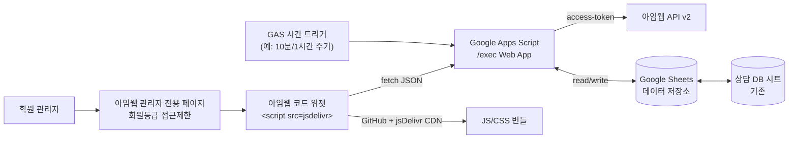
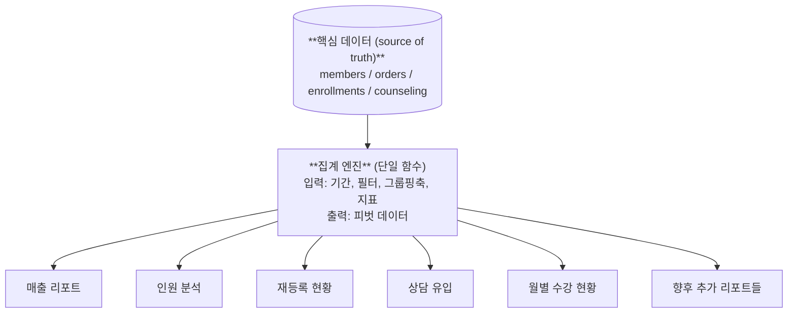
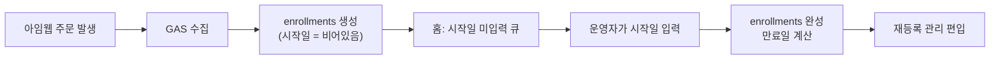
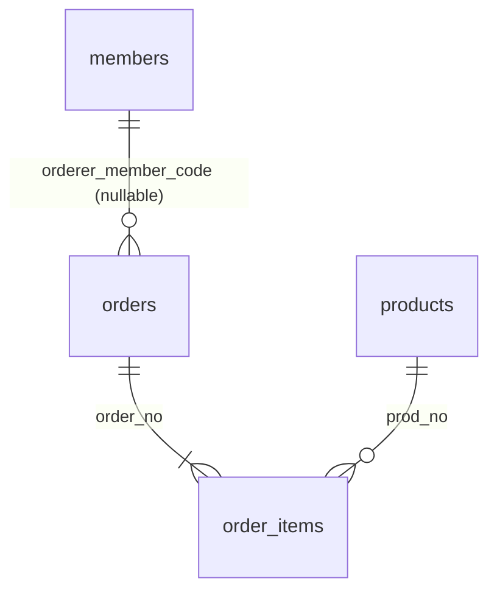

# 학원 관리 대시보드 명세서 (v0.3.5 - 스프레드시트 파일 분리 원칙)

> 이 문서는 같이 디테일을 채워나가는 **살아있는 명세서**입니다. Phase 0(명세 확정) 완료.
>
> **이 파일이 정본입니다.** (`docs/SPEC.md`). 이전 Cursor 플랜 파일(`~/.cursor/plans/학원_대시보드_1차_명세_52fa3465.plan.md`)은 Phase 0 스냅샷으로 보존하되, 앞으로의 변경은 이 파일에만 반영합니다.
>
> **개발 프로토콜**: 각 Phase 착수 전 §9.0의 **A 스키마 → B 시그니처 → C 의사코드 → D 구현** 순서를 따르고, 모든 변경은 `process.md`에 **이유와 함께** 기록합니다.
>
> 남은 TBD: 아임웹 API 실측 필요 2건(TBD-29 환불 사유, TBD-31 리뷰 API) + 클라이언트 자원(상담 DB·API 키 등).

## 1. 프로젝트 목표

아임웹 기반 온라인 학원의 운영 데이터를 한 곳에서 보고 관리할 수 있는 내부용 대시보드를 만든다. 특히 **재등록 관리(누구에게, 언제 연락해야 하는지)**가 핵심 기능이다.

## 2. 아키텍처



**핵심 원칙**
- 아임웹 API 키는 **오직 GAS**에만 둔다. 프론트엔드에는 절대 두지 않는다.
- 프론트엔드 코드는 공개 GitHub 레포 → jsDelivr로 서빙 (무료).
- 대시보드는 원칙적으로 **Sheets의 캐시된 데이터**를 읽는다 (API 한도 보호).
- 접근 제어는 **아임웹 페이지 권한 설정**에 위임.
- **Sheets가 단일 진실 원천(SSOT, Single Source of Truth)** — 대시보드에서 보이는 모든 데이터(원천·파생 집계 모두)는 반드시 Sheets에 저장된다. 대시보드가 죽어도 운영자는 언제든 Sheets를 열어 동일한 정보를 확인/엑셀로 활용 가능.

### 2.1 데이터 중심 설계 원칙 (★★★)

**모든 리포트는 하나의 원천 데이터에서 파생된다.** 매출 리포트, 인원 분석, 재등록 현황, 상담 유입 분석, 월별 수강 현황은 전부 "같은 데이터를 다른 방식으로 자르고 그룹핑한 결과"이다.



따라서 설계/개발의 무게 중심은 다음 순서로 둔다:

1. **핵심 데이터 모델을 완전하고 정확하게** — 특히 `enrollments`에 다음 플래그/파생값이 정확히 찍혀야 함:
   - 수강 시작일, 만료일 (카테고리 기간 또는 상품별 기간 적용)
   - 신규 / 재등록 / 다시옴 구분 (규칙 TBD-3 기반 자동 판정)
   - 환불 여부 / 환불일
   - 카테고리·하위 라벨(track) — 매핑 UI로 관리
2. **집계 엔진 (재사용 가능한 쿼리 함수)** — 한 번 잘 만들면 모든 리포트가 이걸 호출만 함
3. **리포트 화면** — 집계 엔진 호출 + 시각화만 담당 (로직 없음, 표현만)

이 원칙에 따라 **데이터 모델의 정합성이 모든 리포트의 정확성을 결정**한다. 그래서 Phase 1~2(데이터 파이프라인 + 매핑 UI)에 가장 큰 품을 들여야 한다.

#### 2.1.A 두 개의 집계 시간축 (중요)

같은 `enrollments` 레코드를 **두 가지 날짜 축**으로 조회한다. 리포트마다 어떤 축을 쓸지 명확히 구분한다.

| 축 | 기준일 | 용도 |
|---|---|---|
| **구매 축** | `order_date` (구매일) | 매출 리포트(§6.6), 인원 분석(§6.7), 전년도 비교, 카테고리별 구매 건수. "구매한 날 기준으로 얼마나 팔렸나". |
| **수강 축** | `start_date` / `expire_date` | 재등록 관리(§6.3), 만료 알림, 활성 수강 회원 수(§6.10 월별 수강 현황), 이탈 위험(§6.15). "언제부터 언제까지 수강 중인가". |

- 한 건의 `enrollments` 레코드는 두 축 모두 값을 가진다 (구매일은 고정, 시작일은 입력 후 완성).
- 리포트 헤더·UI 툴팁에 **어느 축으로 집계된 수치인지 명시**.

#### 2.1.B 비교 데이터 없음 처리 (공통 규칙)

서비스 시작 초기에는 전년/전월 등 비교 대상 데이터가 아직 없다. 모든 시계열·비교 리포트(§6.6 전년도 비교, §6.12 리텐션 코호트, §6.13 전환 분석, §6.14 MRR 추이, 홈 KPI 달성률 등)는 다음 규칙을 따른다.

- 비교 대상 기간에 데이터가 **없거나 N 미만**이면 해당 값을 `null`로 취급
- UI 표시: **"전년 데이터 없음" / "전월 데이터 없음" / "기준 데이터 부족"** 같은 명시 문구
- 0으로 채우거나 달성률을 100%·∞·0%로 계산하지 않음 (왜곡 방지)
- 데이터가 쌓여 비교 가능해지면 자동으로 정상 값으로 전환

## 3. 아임웹 API 인벤토리

| 카테고리 | 엔드포인트 | 비고 |
|---|---|---|
| 상품 목록 | `GET /v2/shop/products` | `prod_status`, 페이지네이션(최대 100) |
| 상품 상세 | `GET /v2/shop/products/{prod_no}` | |
| 주문 목록 | `GET /v2/shop/orders` | 상태/기간 필터, `order_version` v1·v2; **기간 1요청 ≈3개월 초과 시 API `code=-19`** |
| 주문 상세 | `GET /v2/shop/orders/{order_no}` | 목록·동일 `order_version` 권장 |
| 회원 목록 | `GET /v2/member/members` | `join_time_*`, `last_login_time_*` 필터 |
| 회원 상세 | `GET /v2/member/members/{code|id}` | |
| 품목 주문 목록 | `GET /v2/shop/orders/{order_no}/prod-orders` | 주문서 1건 내 **상품 라인** 단위 (가격·옵션·클레임) |
| 품목 주문 상세 | `GET /v2/shop/orders/{order_no}/prod-orders/{품목주문번호}` | |

### 3.3 아임웹 API 응답 필드 인벤토리 (Phase 1 확정)

아래는 **아임웹 공개 문서(old-developers.imweb.me) 기준 필드명**과, Google Sheets **원천 시트에 실제로 적재할 컬럼**만 정리한 것이다. 상세 스키마(열 순서·헤더 명·GAS 메타 `fetched_at` 등)는 Phase 1 A단계에서 컬럼 정의서로 확정한다.

#### 3.3.1 Members — `GET /v2/member/members` (응답 필드 20개 중 **13개 수집**)

| API 필드 (문서 순서) | 수집 | 비고 |
|---|---|---|
| `member_code` | ○ | PK |
| `uid` | ○ | 로그인 ID. **서비스에서 이메일이 ID인 경우 동일 값** — 별도 `email` 필드는 수집하지 않음 |
| `name` | ○ | |
| `email` | ✕ | 미수집 (ID가 이메일이므로 중복·불필요) |
| `callnum` | ○ | 민감, 상담 DB 매칭 키 |
| `gender` | ○ | |
| `home_page` | ✕ | |
| `birth` | ○ | 민감, §6.16 |
| `addr_post` | ✕ | |
| `addr` | ○ | 민감, §6.16 (시·구) |
| `addr_detail` | ✕ | |
| `marketing_agree_sms` | ○ | |
| `marketing_agree_email` | ✕ | |
| `third_party_agree` | ✕ | |
| `join_time` | ○ | |
| `recommend_code` | ○ | **저장은 하되** 대시보드 기본 노출·조회는 하지 않음 (향후 이벤트·유입 확장) |
| `recommend_target_code` | ○ | 위와 동일 |
| `last_login_time` | ○ | |
| `point_amount` | ✕ | |
| `member_grade` | ○ | **등급 혜택(할인) 분석은 하지 않음** — 수강생 구분·세그먼트용으로만 사용 |

#### 3.3.2 Orders (주문 본체) — `GET /v2/shop/orders` (탑레벨·중첩 중 **10컬럼**)

- **엔드포인트**: 주문 1건 = `GET /v2/shop/orders/{order_no}` (목록 응답도 동일 구조)
- **조회 기간 (아임웹)**: `order_date_from`~`order_date_to` **한 요청**이 너무 길면 `code=-19` (“최대 검색 기간 3개월” 등). GAS는 KST **달력** 청크·`order_version`·이어쓰기·예산·Logger 요약(전체 `JSON.stringify` 금지) 등 **구현·운영 전부** [process.md](../process.md) **「원천(아임웹) 주문·데이터 누적」** 아래 **「구현(코드) — GAS, 한곳에만 정리」** 표. 배포: [gas/README.md](../gas/README.md) (루트 `clasp push`).
- **`order_version`**: v2(주문관리 v2) 주문만 목록에 잡힐 수 있어, 수집 시 v2( Config / Property `ORDERS_LIST_ORDER_VERSION` ).
- **미수집(탑레벨)**: `is_gift`, `device`, `complete_time`, `delivery`, `cash_receipt`, `form`, `use_issue_coupon_codes`, `app`, `device_code` — 집계·대시보드 Phase 1 범위 밖이거나 (배송/앱) 해당 없음. 주문서 **추가 입력폼(`form`)**에 옵션과 동일한 정보가 없음: 상품 **옵션**은 `prod-orders`의 `options`에만 존재.

| Sheets 의미 (컬럼명은 Phase 1 A에서 확정) | API 출처 | 비고 |
|---|---|---|
| 주문서 번호 | `order_no` | `orders` PK, `order_items`가 참조 |
| 주문일시 (구매일·§2.1.A) | `order_time` | Integer Timestamp |
| 주문자 회원코드 | `orderer.member_code` | 비회원이면 공란 가능 |
| 주문자명 | `orderer.name` | |
| 주문자 연락처 | `orderer.call` | 민감, 비회원 식별 |
| 총 결제 전 정가 합(문서: 총 결제금액 계열) | `payment.total_price` | |
| 상품 자체 할인 | `payment.price_sale` | |
| 사용 적립금 | `payment.point` | |
| 쿠폰 할인액 | `payment.coupon` | 쿠폰 **코드 목록** (`use_issue_coupon_codes`)는 미수집 — 캠페인별 효과는 Phase 1에서 집계하지 않음 |
| 실제 결제 금액 | `payment.payment_amount` | **매출 기준(주문 합산 스냅샷)** |

- **주의**: `payment`에 `pay_type` / `pg_type` **미수집** (결제수단별 리포트는 Phase 1 비포함). `orderer.email`·`orderer.call2` 미수집.
- **환불·취소 금액**: 주문 본체 응답에 **라인 합산이 별도 필드로 없음**. 집계는 `order_items`의 `status` / `claim_status` / `claim_type` + 라인 `payment` 기준 (§2.1.B·§3.3.3).

#### 3.3.3 Order items (품목 주문) — `GET /v2/shop/orders/{order_no}/prod-orders` (**14컬럼**)

- **API**: 품목 1행의 `order_no`는 **주문서 번호가 아니라 “품목 주문번호”** (문서상 명칭). Sheets에서는 혼동 방지를 위해 `prod_order_no` 등으로 명명 권장.
- **배송·택배·품목배송지** 관련 필드·하위 구조(`parcel_code`, `invoice_no`, `prod_order_delivery`, `delivery` 등) **미수집** (온라인 학원, 배송 없음).
- **시간**: `pay_time`·배송 시각 **미수집** (실시간 결제 전제, 구매일은 주문 본체 `order_time`).

| 의미 (제안 컬럼명) | API 출처 | 비고 |
|---|---|---|
| 품목 주문 번호 (PK) | `order_no` (※ 품목 쪽) | `prod_order_no` 권장 |
| 상위 주문서 번호 (FK) | 요청 path `{order_no}` | `order_no` (주문서) |
| 품목 상태 | `status` | |
| 클레임 상태 | `claim_status` | 환불·취소 판정 |
| 클레임 타입 | `claim_type` | |
| 상품 번호 | `items[].prod_no` | 시트 `prod_no` 열은 **`items[0]`** 스냅샷; 복수 라인은 `items_json` |
| 상품명 (스냅샷) | `items[].prod_name` | |
| 상품가/라인 정가 (문서: `price`) | `items[].payment` → `price` | 옵션이 가격을 대체하는 모델이면 **실제 판매 단가**로 해석, Phase 1 초기 1~2건으로 실응답 검증 |
| 상품 자체 할인 | `items[].payment.price_sale` | |
| 적립금 (라인) | `items[].payment.point` | |
| 쿠폰 할인 (라인) | `items[].payment.coupon` | |
| 기간/즉시 할인 (라인) | `items[].payment.period_discount` | |
| 옵션값명 (원본) | `items[].options` → `value_name_list` 직렬화 | JSON 배열 권장, **분석의 축은 “옵션 값”이 아니라 “`value_name_list` 전체 항목 개수(아래 `options_count`)"** (§4 옵션·기간 메모) |
| `options_count` | **파생** | 각 옵션 그룹의 `value_name_list` 길이를 **모두 합산** (문서: `b` 방식) |

- **제외**: `items[].no`, `items[].prod_custom_code`, `items[].prod_sku_no`, `items[].delivery` 전부, `items[].is_promotion` — **사은품 API 플래그는 저장하지 않음**. 비매출/사은품은 **라인 `price` = 0** 등으로 **집계 단계**에서 제외.
- **옵션 가격 (ProdOrderItemOption `payment` / N계열)**: Phase 1 **미수집**. 라인 `items[].payment.price`가 실결제 단가로 충분한지 `sync_log`에 초기 샘플로 검증 후 고정.
- **라인 `count` (수량)**: **미수집** (한 주문에 동일 상품 복수 수량 없음 전제).

#### 3.3.4 Products — `GET /v2/shop/products` / `.../products/{prod_no}` (**11컬럼**)

| API 필드 (기본 응답, 문서 순서) | 수집 | 비고 |
|---|---|---|
| `no` | ○ | `prod_no`로 저장 |
| `prod_status` | ○ | |
| `categories` | ○ | 배열 → JSON 문자열 권장 |
| `name` | ○ | |
| `images`~`mobile_content` | ✕ | |
| `prod_type` / `type` (API) | ✕ | 시트에 저장하지 않음 (`prod_type` 열 제거) |
| `prod_type_data` | ○ | JSON 문자열 |
| `use_pre_sale` / `pre_sale_*` | ✕ | 판매기간 미사용 |
| `price` | ○ | |
| `price_org` | ○ | |
| `price_tax` | ✕ | |
| `price_none` | ✕ | **미사용** (「가격 없음」플래그로 보관하지 않음) |
| `point` ~ `prodinfo` | ✕ (정책에 따라) | §3.3.4 단순화: 위 표 외 **미수집** |
| `is_exist_options` | ○ | |
| `is_mix` | ○ | |
| `add_time` | ○ | |
| `edit_time` | ○ | 증분 동기화 기준 권장 |

#### 3.3.5 설계 메모 (옵션·기간·매핑)

- **옵션·수강기간**: 옵션 “값”으로 내부 카테고리를 쪼개지 않는다. `options_count` + `product_mapping`의 **기간 규칙**(`duration_rule` 등, Phase 2 `product_mapping` 확장 시)으로 `enrollments` 만료를 산정. 같은 논리는 §4.2·§4.4와 합치되도록 구현 시 수식을 고정할 것.
- **주문 금액 이중 저장**: `orders`는 **주문 전체 합산 스냅샷**, `order_items`는 **라인 원자** — `sum(라인)` ≈ `orders.payment_*`로 무결성 점검. 세부 불일치 시 주의(주문 단위 전용 조정이 드물게 있을 수 있음, 실데이터로 확인).
- **추천인 필드** (`recommend_*`): DB에는 보관, UI/대시보드 기본 쿼리에서는 제외.

## 3.1 데이터 커버리지와 한계 (★ 사전 공유)

### 본 대시보드로 가능한 것
- 주문·회원·상품 기반의 모든 매출/인원/수강 분석
- 신규/재등록/다시옴/단품 판정, 만료 관리, 재등록 액션 관리
- 리텐션 코호트, MRR, LTV, 전환 분석 (챌린지→솔패스 등)
- 쿠폰/할인/환불 분석, 객단가(ARPU)
- 인구통계 크로스 분석 (성별·연령·지역)
- 이탈 위험 학생 감지 (`last_login_time` 기반)
- 상담 유입 경로별 전환·LTV (상담 DB 연결 시)

### 본 대시보드 범위 밖 (별도 연동 필요, 현 시점 미포함)

| 항목 | 이유 | 우회/확장 방법 |
|---|---|---|
| 사이트 방문자 수·PV·UV (비회원 포함) | 아임웹 API 미제공 | 아임웹 관리자 UI 수기 확인 / GA4 연동 |
| 방문 → 가입 퍼널 | 가입 이전 데이터 없음 | GA4 이벤트 연동 |
| 페이지 히트맵·체류시간 | API 없음 | GA4, Hotjar |
| 상품 조회→장바구니→구매 퍼널 | 조회/장바구니 API 없음 | 아임웹 관리자 "전환 분석" 참고 |
| 검색 키워드별 유입 | API 없음 | GA4 / Search Console |
| 광고 ROI (네이버/구글/메타 광고) | 각 광고 플랫폼 API 필요 | 향후 확장 (각 플랫폼 API 연동 필요) |
| 리뷰/평점 | API 제공 여부 불확실 | 필요 시 추가 조사 `[TBD-31]` |

### 향후 확장 연동 포인트 (메모)
- **GA4**: 비회원 방문·퍼널·유입 채널 세부
- **네이버 검색광고 / 구글 Ads / 메타 Ads API**: 광고비 × 우리 주문 데이터 = 광고 ROI
- **Looker Studio**: Sheets가 원천이므로 추가 분석 대시보드를 덤으로 구성 가능

이 범위는 향후 필요하면 모듈 추가로 확장하면 됨 — 지금 당장의 명세 범위는 **아임웹 API + 상담 DB**로 할 수 있는 최대한이다.

### 3.2 운영 파라미터 (확정)

| 항목 | 값 | 비고 |
|---|---|---|
| 수집 주기 | 1시간 (증분), 매일 04:00 (전체 재동기화) | 시간 트리거 |
| 이탈 위험 N일 | **5일** | 주말 제외 매일 학습 특성 반영 |
| 환불 집계 기준일 | **환불 신청일** | 당일 처리 원칙 |
| 매출·인원 집계 기준일 | **구매일(order_date)** | §2.1.A |
| 수강 관리 기준일 | **수강 시작일/만료일** | §2.1.A |
| 전년도 비교 단위 | **월 단위** | 진행 중 월은 동월 대비 달성률(%) 표시. 비교 대상 데이터 없으면 "전년/전월 데이터 없음" 표시 |
| 회원수 정의 | 기간 내 고유 구매자 수 (무료 상품 포함) | |
| 활성 수강 중 추가 구매 | 재등록 카운트, 시작일 자동(이전 만료일+1) | |
| 자소서 재등록 | 상품별 독립 카운트 (중복 허용) | |
| 솔루틴 단품 | 같은 월 복수 구매 → 월 1건으로 묶음 | 월 경계 넘어가면 각 월 1건 |
| 권한 모델 | 1차: 전체 권한 공통 | 향후: 아임웹 위젯 임베드 특성 활용한 회원 권한 연동 |
| 백업 | 주 1회 전체 복제, 12주치 보관 | GAS 트리거 |
| 이상 감지 임계값 / KPI 목표 | **§6.19 KPI 관리 화면에서 운영자 등록** | `kpi_goals`, `kpi_thresholds` 시트 |
| 초기 데이터 소급 범위 | **아임웹 개설 시점부터 전체 수집** | 정확한 시작 일자는 Phase 1 착수 시 클라이언트 제공 |
| 대시보드 UI 회원 식별 | **이름 + 아임웹 아이디 + 연락처** 기본 노출 | 업무상 필요. 이메일/주소/생년월일은 상세에서 마스킹+원본 보기 |
| 다운로드/내보내기 | **통계 리포트: 허용 (Excel/CSV/PDF/Sheets 열기)** <br>**개별 명단: 금지 (프린트 뷰만)** | §5.6·§6.17 |
| 모바일 대응 | **없음 (데스크톱 전용)** | 필요 시 향후 확장 |
| 에러 알림 채널 | Phase 1 실측 후 확정 (아임웹 알림 API 또는 카카오 비즈 알림톡 또는 이메일) | 무료 범위 우선 |
| 배포 전략 | 아임웹 코드 위젯 = 로더(한 줄) + GitHub/jsDelivr = 앱 본체 | 버전 태그(`@v1.x.y`)로 캐시 무효화 |

## 4. 내부 카테고리 정의 (확정)

학원 상품은 크게 **4개의 내부 카테고리**로 분류된다. 각 카테고리는 기간/옵션/통계 취급 방식이 다르다.

### 4.1 카테고리 개요

**대분류 5개로 확정.** 하위 라벨/상품 식별은 §6.4 매핑 UI에서 운영자가 직접 관리 (과거 상품명·기수 혼재 등의 이슈는 매핑 UI에서 흡수).

| 내부 카테고리 코드 | 이름 | 유형 | 기본 기간 | 하위 구분 | 통계 비중 |
|---|---|---|---|---|---|
| `textbook` | 교재 | 물품 (기간 없음) | — | — | 중 (구매 이력만) |
| `solpass` | 솔패스 | 관리 프로그램 | **28일 고정** | 문과 / 이과 (별개 상품) | 상 |
| `challenge` | 챌린지 | 특강 프로그램 | 14일 기본, 상품별 덮어쓰기 가능 | **없음 — 챌린지 전체 통합 집계** (기수/세부명 구분 안 함) | 상 |
| `solutine` | 솔루틴 매일학습지 | 정기 학습지 (월별/주차별) | 28일(정기) / 주차 단위(단품) | **정기(한달형)** / **단품(주차별)** | 중 |
| `jasoseo` | 자소서 | 별도 프로그램 | 기본값 `[운영자 지정]` | — | 중 |

### 4.2 카테고리별 상세 규칙

#### 교재 (`textbook`)
- 수강 기간 개념 없음 → `enrollments`에 만료일 없이 구매 이력으로만 기록
- 회원 상세 화면에서 "구매한 교재 목록" 표시
- 재등록/만료 로직에서 제외

#### 솔패스 (`solpass`)
- 기간 **28일 고정**
- 하위 속성 `track` = `이과` | `문과`
  - 이과와 문과는 **별개의 아임웹 상품(상품번호 다름)** → 상품 매핑 UI에서 각 상품에 `track` 값을 지정
- 재등록 관리 대상 (만료 D-N일 알림)

#### 챌린지 (`challenge`)
- 기본 14일, 상품마다 기간이 달라질 수 있음 → 상품 매핑 UI에서 상품별 기간을 덮어쓰기 가능
- **기수/세부명 구분 없이 "챌린지" 단위로 통합 집계** (개별 챌린지별 드릴다운 불필요)
- 재등록 관리 대상

#### 솔루틴 매일학습지 (`solutine`)

**두 가지 구매 유형(`plan_type`)** 으로 내부 분리. 매핑 UI에서 상품별로 지정.

| 유형 | 코드 | 설명 | 재등록 판정 | 기간 |
|---|---|---|---|---|
| 정기 (한달형) | `monthly` | 한 달 4주 전체 묶음 | **대상** (솔패스와 동일 규칙) | 28일 |
| 단품 (주차별) | `single` | 특정 주차만 단품 구매 | **비대상** (단순 구매 이력) | 해당 주차(일수)만 |

- 사전 등록 가능 (미래 시작일로 구매)
- 매출/인원 리포트에서는 "솔루틴 전체"로 합산 보기와 "정기/단품 분리 보기" 모두 지원
- **회원 관리 화면에서는 한 회원의 모든 솔루틴 구매 이력(정기+단품)을 함께 표시**해 한눈에 파악
- 재등록 현황 리포트에는 `solutine_monthly`만 포함, `solutine_single`은 제외

#### 자소서 (`jasoseo`)
- 솔패스·챌린지와 다른 **별도 대분류**
- 기간 및 운영 방식 디테일은 운영자가 상품 매핑 UI에서 지정
- **상품별 독립 재등록**: 같은 회원이 다른 자소서 상품(예: 서울대 자소서 + 연대 자소서)을 각각 사면 **각각 재등록으로 중복 카운트** (실제로 각 상품을 모두 수강한 것이므로 정상 카운트)
- 재등록 규칙: 기본은 챌린지 방식(공백 무관), 매핑 UI에서 상품별 오버라이드 가능

### 4.3 신규 / 재등록 / 다시옴 판정 규칙 (확정)

enrollment가 생성될 때 아래 규칙에 따라 플래그를 자동 계산한다.

#### 솔패스 (`solpass`)
기간 D = 28일. 플래그 3종.

| 플래그 | 조건 |
|---|---|
| **신규** | 솔패스를 처음 구매 |
| **재등록** | 직전 수강 **만료일 ≤ 새 시작일 ≤ 만료일 + D** |
| **다시옴** | 직전 수강 **만료일 + D < 새 시작일** |

- 카테고리 단위 판정 (문과 → 이과 전환도 같은 카테고리라 "재등록". UI에서 "반변경" 표시)
- **활성 수강 중 추가 구매(연장)**: "재등록"으로 카운트 + 내부 플래그 `is_extension=true`. **시작일은 자동으로 기존 수강 만료일 + 1일로 설정** (운영자가 수동 입력할 필요 없음). 6개월 이상 공백 복귀는 "장기 다시옴" 배지 별도 표시 (카운트는 "다시옴")

#### 솔루틴 (`solutine`)
**정기/단품 모두 "솔루틴 수강생"으로 함께 카운트**. 분류 플래그는 아래 4종 중 하나로 배타적 부여. 총원 = 신규 + 재등록 + 다시옴 + 단품.

| 플래그 | 조건 |
|---|---|
| **신규** | `plan_type=monthly`를 처음 구매 (정기 첫 구매) 또는 단품 첫 이용 |
| **재등록** | 직전 만료일 ≤ 새 시작일 ≤ 만료일 + 28일 (정기 또는 단품 기반) |
| **다시옴** | 직전 만료일 + 28일 < 새 시작일 |
| **단품** | `plan_type=single` 구매 |

**단품 묶음 카운트 규칙 (중요)**
- 같은 월에 같은 회원이 **여러 주차 단품을 구매해도 "그 월의 단품 1건"으로 묶어 카운트** (예: 4월 1주차 + 2주차 + 3주차 구매 → 4월 단품 1건)
- **다른 월을 넘어가는 조합은 각 월에 1건씩**:
  - 예: 4월 4주차(단품) + 5월 정기 → 4월에 "신규 단품 1", 5월에 "재등록 1" (단품→정기 전환도 재등록으로 취급)
  - 같은 월에 정기 + 단품 동시 구매는 운영 상 발생하지 않음

- 단품 구매자도 솔루틴 수강생 명단·리포트에 함께 표시

#### 챌린지 (`challenge`)
특강 성격이라 공백 기간을 따지지 않는다.

| 플래그 | 조건 |
|---|---|
| **신규** | 해당 회원이 **챌린지를 처음 구매**하는 경우 |
| **재등록 (=재이용)** | 과거에 챌린지 구매 이력이 있는 회원의 새 챌린지 구매 (같은 챌린지/다른 챌린지 무관, 공백 무관) |

- 다시옴 개념 없음
- UI 라벨은 "재등록" 또는 "재이용" 중 택일하여 일관되게 사용

#### 교재 (`textbook`) / 자소서 (`jasoseo`)
- 교재: 재등록 판정 **없음** (구매 이력만 관리)
- 자소서: 재등록 판정 대상 여부는 매핑 UI에서 설정 `[TBD-25]` (디폴트는 챌린지와 동일한 "재이용" 규칙)

#### 공통 보조 규칙 (확정)

- **과거 주문 수강 시작일 폴백**: 운영자가 시작일을 수기 입력하지 않은 과거 주문은 `start_date = order_date`로 간주한다. 만료일·재등록 판정도 이 값을 사용.
  - 이유: 아임웹 개설 시점부터 전체 소급 수집하므로 과거 주문 하나하나에 시작일을 수기 입력하는 것은 비현실적. 대신 **신규 주문부터는 시작일 관리 화면(§6.5)에서 입력하는 것을 원칙**으로 한다.
  - 영향: 과거 데이터의 재등록 판정은 실제보다 다소 엄격해질 수 있으나(학생이 나중에 시작한 경우 이 폴백으로는 구매일부터 카운트되므로), 통계 목적에선 수용 가능.
  - 운영자가 사후에 수기 입력하면 해당 값으로 즉시 덮어쓰고 재계산.

- **환불 주문은 재등록/다시옴 카운트에서 제외**: 환불 처리된 주문은 `enrollments`에서 해당 플래그 부여 대상이 아니며, 후속 주문의 재등록/다시옴 기준이 되는 "직전 수강"으로도 취급하지 않는다.
  - 이유: 환불 = 실제 수강 이력 없음. 카운트에 포함하면 재등록률/전환률이 왜곡됨.
  - 영향: 매출 환불 집계(§2.1.A, 신청일 기준 당일 처리)에는 그대로 반영 — 이는 별도 축이므로 충돌 없음.
  - `enrollments`의 해당 행은 `status='refunded'`로 표기하여 감사 추적은 가능하게 유지.

### 4.4 공통: 수강 시작일 (확정)

**모든 기간성 상품(solpass / challenge / solutine)은 "수강 시작일"이 주문일과 별개**이며, 만료일 = 시작일 + 카테고리/상품별 기간.

**시작일 취득 방식: 대시보드에서 운영자가 직접 입력 (수동 입력 방식)**

- 아임웹 주문 API에는 시작일이 들어오지 않음
- 주문이 수집되면 `enrollments`에 "시작일 미입력" 상태로 생성됨
- 운영자는 학생과 조율된 시작일을 **대시보드의 시작일 관리 화면(§6.5)** 에서 입력
- 입력 즉시 만료일이 계산되고 `enrollments`·재등록 관리에 반영됨
- 홈 화면에 **"시작일 미입력 건수"** 를 작업 큐로 상시 노출 (운영자 리마인더)

**운영 흐름**


## 5. Google Sheets 데이터 모델 (초안)

**모든 시트·스프레드시트는 운영자가 직접 열람 가능**해야 함 (SSOT 원칙). 다만 **파일은 한 개로만 묶지 않는다** — §5.0.

### 5.0 스프레드시트 파일 분리 원칙 (확정)

- **원천(아임웹) DB**는 **전용 스프레드시트 1개**에만 둔다 — 시트: `members`, `orders`, `order_items`, `products` 및 수집 보조 `sync_log`(§5.1). 여기에는 **아임웹 수집·동기화와 직접 연결된 탭만** 두고, 탭 수·책임 범위를 이 수준으로 **고정**한다.
- **운영/파생**(`product_mapping`, `enrollments`, `renewal_actions`, …)과 **집계 캐시**(`agg_*`)는 탭이 늘면 **한 파일 안이 복잡해지므로**, **별도의 Google 스프레드시트(새 파일)**로 둔다. (예: 운영용 1개 파일, 집계용 1개 파일 — 필요 시 더 쪼갬.)
- 스프레드시트 간 연결은 **GAS Script Properties**에 스프레드시트 ID를 두는 방식으로 한다. (예: `SHEETS_MASTER_ID` = 원천, 추후 `SHEETS_OPERATIONS_ID`·`SHEETS_AGG_ID` 등 — 이름은 구현 시 일원화.)
- 목적: Drive·권한·백업·인지 부담을 **파일 경계**로 나누고, 원천 무결성과 운영 편집을 분리한다.

### 5.1 원천 데이터 (아임웹 수집)

필드 단위는 **§3.3**이 정본이다. 요약:

- `members` — 회원 스냅샷. API 20필드 중 13필드 수집(§3.3.1). 별도 `email` 열 없음(로그인 `uid`가 이메일인 경우 동일). 추천인 코드 2개는 **저장·미노출** (§3.3.1).
- `orders` — **주문서** 단위 1행. 주문번호, 주문일시, 주문자(회원코드/이름/연락처), `payment` 합산 금액 5개(total_price, price_sale, point, coupon, payment_amount) — §3.3.2. **결제수단·쿠폰코드·주문서 폼**은 수집하지 않음.
- `order_items` — **품목 주문**(상품 라인) 단위. 품목주문번호, 상위 주문번호, `status`/`claim_*`, 상품번호·상품명, 라인 `payment` 5필드, 옵션 `value_name_list` raw + `options_count` — §3.3.3. **환불·취소 집계**는 이 시트의 클레임 필드 + 라인 금액(주문 본체에 별도 환불액 없음, §3.3.2).
- `products` — 상품 메타 12필드(§3.3.4). `edit_time` 기준 증분 동기화 권장.
- GAS 메타: `fetched_at`, `sync_batch_id` 등은 구현 시 `sync_log`·각 시트 optional 컬럼로 추가 가능.

#### 데이터 층위 (통계·아웃풋이 어디서 나오는지)

**아임웹 API → 원천 4시트**만으로는 “매출/재등록/만료” 같은 **업무 지표**가 자동으로 완성되지 않는다. 파이프라인은 층으로 나뉜다.

| 층 | 시트(예) | 누가 갱신 | 용도 |
|---|---|---|---|
| **0 — 원천** | `members`, `orders`, `order_items`, `products` | GAS(아임웹 API) | SSOT·감사·라인 단위 환불/옵션. **읽기 전용 lock** (§5.5) |
| **1 — 운영/파생** | `product_mapping`, `enrollments`, `renewal_actions`, … | 운영자 UI·빌더(GAS) | 카테고리 매핑, 수강 기간, 신규/재등록 판정, 재등록 업무 |
| **2 — 집계 캐시** | `agg_*` | Aggregator(GAS) | 대시보드·엑셀에 내보내기 좋은 **이미 잘린 요약 표** (§5.3) |

- **Phase 1 목표**: 층 **0** (수집 + `sync_log`) 안정화. 층 1~2는 **다음 Phase**에서 `enrollments`·`product_mapping` 확장, `agg_*` 컬럼을 **또** 정의(별 스키마)한다.
- 통계/리포트 **아웃풋**은 최종적으로 **층 2** 또는 집계 엔진이 층 0+1을 **조회·연산**한 결과로 만든다(§2.1).

#### 원천 엔티티 관계 (ER)

Google Sheets **탭=엔티티**, **열=속성**으로 본 참조만 표시. `orders`는 비회원 주문일 수 있어 `orderer_member_code`가 **공란**이면 `members`와 **연결되지 않는 행**이 될 수 있음(선택적 관계).



- **1 : N** — 한 회원이 여러 주문(회원일 때). 한 주문이 여러 품목 행(라인). 한 상품이 여러 품목 행에 반복.
- **PK·FK** 상세·컬럼 타입은 **§5.1.1** 표가 정본.

#### 5.1.1 원천 시트 컬럼 정의 (Phase 1 — GAS 시트 헤더 확정)

**네이밍**: 시트 1행 헤더는 **스네이크 케이스(영문)**. 값은 **문자열로 통일**해도 되는 열(타임스탬프)은 GAS에서 ISO 8601(KST) 문자열 권장.

**공통(선택, 모든 원천 시트 동일)**: GAS가 마지막에 덮어쓸 수 있게 열 2개를 **오른쪽**에 둔다.

| 열 | 타입 (Sheets) | 설명 |
|---|---|---|
| `fetched_at` | String (ISO 8601) | 이 행을 마지막으로 쓴 시각 |
| `source_sync_id` | String | `sync_log`와 묶는 배치 ID(없으면 공란) |

---

##### 시트: `members` (1행=헤더, 2행~=데이터)

| 열(헤더) | 타입 | PK | 제약·비고 |
|---|---|---|---|
| `member_code` | String | PK | |
| `uid` | String | | 로그인 ID(이메일일 수 있음) |
| `name` | String | | |
| `callnum` | String | | 민감. `-`·공백 정규화는 GAS에서 |
| `gender` | String | | `F` / `M` 등 API 그대로 |
| `birth` | String | | 민감. API 형식 그대로 |
| `addr` | String | | 민감. 시·구 |
| `marketing_agree_sms` | String | | `Y`/`N` |
| `join_time` | String | | API가 주는 문자열 그대로 또는 정규화 |
| `recommend_code` | String | | UI 기본 비노출(§3.3.1) |
| `recommend_target_code` | String | | 동일 |
| `last_login_time` | String | | |
| `member_grade` | String | | |

---

##### 시트: `orders`

| 열(헤더) | 타입 | PK | 제약·비고 |
|---|---|---|---|
| `order_no` | String | PK | 주문**서** 번호 |
| `order_time` | String | | KST ISO 권장. **구매일(§2.1.A)** |
| `orderer_member_code` | String | | 비회원 주문 시 공란 |
| `orderer_name` | String | | |
| `orderer_call` | String | | 민감 |
| `total_price` | Number | | `payment.total_price` |
| `price_sale` | Number | | |
| `point` | Number | | |
| `coupon` | Number | | |
| `payment_amount` | Number | | |

---

##### 시트: `order_items`

| 열(헤더) | 타입 | PK / FK | 제약·비고 |
|---|---|---|---|
| `prod_order_no` | String | **PK** | API 품목 응답의 `order_no` (주문서 번호와 **다름**) |
| `order_no` | String | **FK** → `orders.order_no` | URL·부모 주문의 주문서 번호 |
| `status` | String | | |
| `claim_status` | String | | |
| `claim_type` | String | | |
| `prod_no` | Number | | `products.prod_no` |
| `prod_name` | String | | 주문 당시 스냅샷 |
| `line_price` | Number | | `items[].payment.price` (라인 판매가) |
| `line_price_sale` | Number | | `items[].payment.price_sale` |
| `line_point` | Number | | |
| `line_coupon` | Number | | |
| `line_period_discount` | Number | | |
| `options_raw` | String | | `items[0].options` JSON (열람용 요약) |
| `options_count` | Number | | `items[]` **전체**에 대해 `value_name_list` 항목 개수 **합** (§3.3.3) |
| `items_json` | String | | API `items` 배열 **전체** JSON. 복수 라인 **행 분할 없음** — 원천은 라인집계 DB가 아님(같은 `prod_no`가 여러 번 나와도 **PK는 `prod_order_no` 1행**). |

- **1 품목주문 블록**(`GET …/prod-orders` 응답 1 object) = **1행** (PK `prod_order_no`). `line_*`·`prod_no`·`prod_name`·`options_raw`는 **`items[0]`** 기준 스냅샷(빠른 스캔); 나머지 라인은 `items_json`에서 파싱. 셀 5만자 초과 시 GAS/Sheets 제한(운영에서 드묾)에 유의.

---

##### 시트: `products`

| 열(헤더) | 타입 | PK | 제약·비고 |
|---|---|---|---|
| `prod_no` | Number | PK | API 필드 `no` |
| `prod_status` | String | | `sale` / `soldout` / `nosale` |
| `categories` | String | | API 배열 → JSON 문자열 |
| `name` | String | | |
| `prod_type_data` | String | | JSON 문자열 |
| `price` | Number | | |
| `price_org` | Number | | |
| `is_exist_options` | String | | `Y`/`N` |
| `is_mix` | String | | `Y`/`N` |
| `add_time` | String | | Timestamp → ISO KST |
| `edit_time` | String | | **증분 동기화** 기준 |

---

> **이후 Phase**: `enrollments`, `product_mapping` 확장(기간 규칙), `agg_*` 각 시트는 **별도 섹션(§5.1.2~ 또는 구현 티켓)** 으로 컬럼 정의를 붙인다. 원천(§5.1.1)과 혼동하지 말 것.

### 5.2 운영자 관리 (수동/UI 입력)

> **파일 배치(§5.0)**: 아래 시트들은 **원천 DB와 별도의 스프레드시트 파일**에 두는 것을 원칙으로 한다(한 파일에 탭만 구분하거나, 용도별로 파일을 더 쪼갤 수 있음). ID는 Script Properties로 연결.

- `product_mapping` — 상품번호 → 내부 카테고리·기간·트랙·plan_type·재등록대상여부
- `enrollments` — 수강 이력 마스터. 주문 수신 시 pending_start로 생성 → 시작일 입력 시 완성 → 만료일 자동 계산. 카테고리·신규/재등록/다시옴/단품 플래그 포함. 활성 수강 중 추가 구매(연장)는 `is_extension=true` + 시작일 자동(= 이전 만료일+1) 저장
- `renewal_actions` — 재등록 대상자 상태 (회원코드, 대상 카테고리, 만료일, 등록여부, 등록예정일, 미등록사유, 반변경, 연락상태, 메모)
- `member_tags` — 회원별 태그/메모 (VIP, 장학생 등)
- `dropout_risk_actions` — 이탈 위험 학생 연락/처리 이력
- `kpi_goals` — 월별/카테고리별 KPI 목표 (매출, 신규, 재등록, 활성 회원 등) — §6.19
- `kpi_thresholds` — 이상 감지 임계값 (매출 변동률, 재등록률 하락, 환불율 등) — §6.19

### 5.3 파생 집계 캐시 (Aggregator가 주기적으로 갱신)

> **파일 배치(§5.0)**: **원천·운영과 별도 스프레드시트 파일**에 두는 것을 원칙으로 한다(집계 전용 1파일 또는 지표별 분리).

- `agg_daily_sales` — 날짜 × 카테고리 × track 매출·환불
- `agg_monthly_headcount` — 월 × 카테고리 × 플래그(신규/재등록/다시옴/단품) 인원수
- `agg_renewal_monthly` — 월별 재등록 현황 집계
- `agg_cohort_retention` — 코호트(첫 등록 월) × N개월 후 유지 비율
- `agg_conversion` — 전환 분석 (챌린지→솔패스 등)
- `agg_mrr` — 월별 MRR 추이
- `agg_ltv` — 회원별 LTV 스냅샷
- `agg_funnel_inflow` — 유입 경로별 전환·LTV

→ 집계 캐시를 Sheets에 두는 이유: 대시보드 빠른 응답 + 운영자가 Sheets로 직접 열람·엑셀 활용 + 외부 도구(Looker Studio 등)에서 추가 분석 가능

### 5.4 부가/운영
- `counseling_db` — `[TBD-5]` 기존 상담 시트 구조 확인 후 연결 방법 정의
- `sync_log` — GAS 수집/집계 작업 로그 (실행시각, 수집 건수, 에러)
- `audit_log` — 사용자 변경 이력 (누가/언제/무엇을 변경)
- `settings` — 전역 설정값 (이탈 위험 N일=5, 재등록 대상 D-N일 등) ※ KPI/임계값은 `kpi_*` 시트에 분리

> **원천 4시트** 컬럼은 **§5.1.1 확정**. `enrollments`·`product_mapping`·`agg_*` 등 나머지는 Phase 2~3에서 컬럼 정의를 추가한다.

### 5.5 시트 편집 허용 범위 (확정)

| 구분 | 시트 | 편집 가능 |
|---|---|---|
| 원천 (아임웹 수집) | `members`, `orders`, `order_items`, `products` | **불가 (lock)**. 무결성 유지를 위해 대시보드·수동 모두 읽기 전용. GAS만 쓰기. |
| 파생 캐시 | `agg_*` | **불가 (lock)**. Aggregator만 쓰기. |
| 운영자 관리 | `product_mapping`, `enrollments`, `renewal_actions`, `member_tags`, `dropout_risk_actions`, `kpi_goals`, `kpi_thresholds`, `settings` | **가능**. 대시보드 UI 또는 Sheets 직접 편집 모두 허용 |
| 로그 | `sync_log`, `audit_log` | GAS만 쓰기, 사람은 읽기 |

- 보호: `members/orders/order_items/products/agg_*/sync_log/audit_log`는 Google Sheets의 시트/범위 보호 기능으로 편집 금지 설정
- 편집 가능한 시트는 운영자가 Sheets에서 직접 수정해도 다음 집계 사이클에 정상 반영되도록 Aggregator가 방어적으로 읽기

### 5.6 개인정보 처리 정책 (확정)

학원이 실명 인증을 받지 않는 온라인 서비스이고, 대시보드는 최소 권한·최소 노출 + **개인 식별 가능 데이터의 파일 유출 경로만 구조적으로 차단**한다.

#### 원칙
- **수집**: `members`에는 §3.3.1이 정한 **필드만** 저장한다(전 필드 full copy 아님). **별도 `email` 열은 두지 않음** — 아임웹 `uid`가 곧 로그인 ID(이메일일 수 있음)이다.
- **대시보드 UI 노출**: **이름 + 아임웹 아이디(`uid`) + 연락처(전화번호)** 는 업무상 필요로 기본 노출. 민감 필드(**생년월일·주소(시·구)** 등)는 상세 화면에서 **마스킹 표시**하고 "원본 보기" 버튼을 눌러야 해제.
- **다운로드**: **통계·집계 리포트는 허용, 개인 식별 가능 리스트는 금지** — 상세 규칙은 §6.17
- **감사 로그**: "원본 보기" 클릭 등 PII 열람 행위는 `audit_log`에 기록.
- **마케팅 활용**: 마케팅 동의자 연락처 활용이 필요하면 아임웹 관리자 페이지 자체 기능 사용 (본 대시보드는 유입 분석·전환율 판단까지만 담당).

#### 적용 규칙 (화면별)
| 화면 | 기본 노출 | 상세 열람 (마스킹 해제) | 파일 내보내기 |
|---|---|---|---|
| 회원 리스트(§6.2) | 이름, 아이디, **연락처**, 카테고리, 상태, 마지막 로그인 | — | **불가** (개인 식별) |
| 회원 상세(§6.2) | 이름, 아이디(`uid`), 연락처, 성별, 연령대 | 생년월일, 주소(시·구) 등은 관리자 "원본 보기" 버튼 (별도 이메일 열 없음) | 불가 |
| 재등록 관리(§6.3) | 이름, 아이디, **연락처**, 등록 상태 | 상세에서만 생년월일·주소 마스킹 해제 (이메일 열 없음) | **불가** (개별 명단) |
| 이탈 위험(§6.15) | 이름, 아이디, **연락처**, 마지막 로그인 | 동일 | **불가** (개별 명단) |
| 우수학생/프로모션(§6.20) | 이름, 아이디, **연락처**, 달성 지표 | 동일 | **불가** (개별 명단) |
| 매출 리포트(§6.6) | 집계 수치만 | — | **가능** (.xlsx / .csv / .pdf / Sheets 열기) |
| 인원 분석(§6.7) | 집계 수치만 | — | **가능** |
| 재등록 현황 집계(§6.8) | 집계 수치만 (개별 명단 없음) | — | **가능** |
| 월별 수강 현황(§6.10) | 집계 수치만 | — | **가능** |
| 상담 유입(§6.9) | 집계 수치만 | — | **가능** |
| 기타 운영 지표/리텐션/전환/MRR/프로파일(§6.11~14, 16) | 집계 수치·차트 | — | **가능** |

## 6. 기능 범위 (뼈대)

### 6.1 홈 (요약 대시보드)

운영자가 매일 아침 한 번 열어서 하루를 시작하는 화면. 위젯들의 조합.

**핵심 지표 위젯**
- 현재 활성 회원 수 (솔패스/챌린지 카테고리별 breakdown, 솔패스는 이과/문과)
- 이번 달 신규 / 재등록 / 다시옴 카운트 (카테고리별)
- 매출 요약 (오늘/이번 주/이번 달, 전년 동기 비교)
- **MRR** (이번 달 확정 / 다음 달 예상)

**액션 큐 위젯**
- 이번 주 만료 예정 회원 수 (카테고리별, 클릭 시 §6.3 이동)
- **이탈 위험 학생 수** (활성 수강 + 최근 로그인 N일 이상 전) — 클릭 시 §6.16 이동
- **시작일 미입력 건수** — 클릭 시 §6.5 이동
- **미분류 상품 수** — 클릭 시 §6.4 이동

**KPI 대비 달성률 위젯** (§6.19 KPI 관리 기반)
- 이번 달 목표 매출 대비 현재 달성률 (%)
- 이번 달 목표 신규 회원 대비 달성률
- 이번 달 목표 재등록률 대비 달성률
- KPI 미달성 시 경고 배지, KPI 임계값 초과 이상 변동 시 알림

### 6.2 회원 관리

**회원 리스트**
- 검색 (이름 / 아임웹 아이디 / 연락처)
- 필터: 카테고리, 상태(활성/만료임박/만료/휴면), 성별, 연령대, 지역 (아임웹 회원정보 기반 집계만)
- 정렬: 최근 구매일 / 가입일 / LTV(평생 구매액) / 만료 임박 순
- **노출 컬럼**: 이름 / 아임웹 아이디 / 연락처 / 카테고리 / 상태 / 마지막 로그인 (§5.6 정책)

**회원 상세 화면**
- 기본정보: 이름 / 아임웹 아이디 / 연락처 / 성별 / 연령대 (직접 노출)
- 나머지 민감 필드(이메일, 주소, 생년월일)는 **마스킹 표시**, 관리자가 "원본 보기" 클릭 시만 해제 + `audit_log` 기록
- **회원 타임라인 뷰 (통합)** — 시간순으로 구매/만료/재등록/다시옴 이벤트를 한 타임라인에 표시
  ```
  2025-10-05  챌린지 "노베이스" 구매/참여
  2025-10-20  솔패스 문과 시작 (신규)
  2025-11-17  만료 → 11-20 재등록 (공백 3일)
  2025-12-15  솔패스 이과로 재등록 (반변경)
  2026-01-12  만료 → 공백 25일 → 다시옴
  ```
- 카테고리별 수강 이력 요약 섹션 (솔패스/챌린지/솔루틴/자소서/교재)
- **LTV**(총 구매액), 평균 재등록 주기, 재등록 횟수
- 마지막 로그인 시각, 최근 30일 로그인 횟수
- 연결된 상담 이력 (상담 DB 연동 후 `[TBD-5]`)
- 상담 메모 추가 `[TBD-5]`
- 태그/메모 남기기 (예: "VIP", "장학생")

### 6.3 재등록 관리 (핵심)

**카테고리 특성에 따라 두 가지 모드의 화면 제공.** (§4.3 규칙에 따라 표시 정보가 다름)

#### 6.3.A 솔패스 / 솔루틴 — 만료 대상자 관리 (상세 모드)

`만료 예정 + 최근 만료` 학생 명단. 운영자가 각 학생별로 후속 조치를 기록.

**솔루틴은 정기 수강생만 이 화면에 표시** (단품은 만료 추적 대상 아님). 단 솔루틴 수강 현황 리포트(§6.10)에서는 단품도 함께 카운트.

컬럼 (첨부 이미지 1 기반):
- 이름
- 아임웹 아이디 (이메일 형식일 경우 원문 그대로 표시 — 아이디 성격)
- 연락처 (전화번호)
- **등록여부** (등록완료 / 미입력 / 등록X)
- **등록예정일** (운영자 입력 날짜)
- **미등록 사유** (텍스트)
- **반변경** (문과↔이과 전환 체크/메모) — 솔패스 전용
- 직전 만료일 / 공백 일수 / 판정(재등록/다시옴/미등록)

요약 카드 (우측):
- 총인원 / 등록완료 / 등록예정 / 등록X / 연락필요

필터: 대상 월, 카테고리(솔패스/솔루틴), 트랙(문과/이과)

#### 6.3.B 챌린지 — 신규/재등록 명단 (간단 모드)

특강 성격이라 "만료 추적"이 아닌 "이번 챌린지 참여자 명단 + 신규/재등록 분류".

컬럼 (첨부 이미지 2 기반):
- 이름
- 아이디
- **신규 / 재등록** (자동 판정, 재등록이면 이전 들었던 상품 정보 함께 표시)

요약 카드:
- 총인원 / 신규 / 재등록

필터: 챌린지 기간(또는 월), 상품(선택적)

#### 공통
- 학생 행 클릭 → 회원 상세 (§6.2)로 이동
- 상태 변경 내역은 `renewal_actions` 시트에 기록
- 자소서는 `[TBD-25]` 결정에 따라 챌린지 모드 또는 솔패스 모드 재사용

### 6.4 상품 ↔ 내부 카테고리 매핑 UI (중요)
- `product_mapping` 시트를 대시보드에서 편집
- 화면: 아임웹에서 수집된 상품 리스트 → 각 상품마다 아래 메타 지정
  - **내부 카테고리** (textbook / solpass / challenge / solutine / jasoseo) 드롭다운
  - **기간(일)**: 카테고리 기본값 자동 입력 후 필요 시 수정 (교재는 비활성)
  - **솔패스 track**: 문과 / 이과 (카테고리가 solpass일 때만 표시)
  - **솔루틴 plan_type**: 정기(monthly) / 단품(single) (카테고리가 solutine일 때만 표시)
  - **재등록 관리 대상 여부**: 체크박스 (카테고리+유형별 기본값 있음)
- 저장 시 GAS를 통해 Sheets 업데이트
- 신규 상품이 아임웹에 등록되면 "미분류" 상태로 뜨고, 여기서 매핑해줘야 통계에 반영됨
- **과거 상품(이름이 달라진 옛 상품)도 이 화면에서 일관된 카테고리로 매핑** → 이름 혼선을 시스템이 흡수

### 6.5 시작일 관리 화면 (필수)
- **시작일 미입력 enrollment 리스트** — 카테고리/주문일 순 정렬, 검색
- 각 행: 회원명, 카테고리, 상품명, 주문일, 시작일 입력칸(달력)
- 입력 → 저장 시 GAS가 만료일 계산해 `enrollments` 완성
- 일괄 입력(여러 건 같은 시작일) 지원 고려
- 이미 입력된 건도 **수정 가능** (만료일 재계산)

### 6.6 통계 — 매출 현황 (핵심 리포트)

기존 수기 엑셀 리포트("솔패스 온라인 매출 현황")를 자동 생성하는 화면. 현재 엑셀 구조를 그대로 재현하고 확장한다.

#### 레이아웃 (피벗 테이블)
- **행**: 카테고리 > 하위 구분 > 세부 지표 (매출/환불/주간합계/월별합계)
- **열**: 일별 (선택한 월/주의 모든 일자) → 주간 합계 → 월별 합계
- **필터**: 연도(2025/2026/...), 월, 주차

#### 카테고리별 집계 구조

| 대분류 | 하위 구분 | 집계 단위 |
|---|---|---|
| 교재 | (단일) | 매출, 환불 |
| 솔루틴 | 정기(monthly) / 단품(single) 합산 보기 기본, 분리 보기 토글 | 매출, 환불 |
| 챌린지 | (통합 — 하위 구분 없음) | 매출, 환불, 주간합계, 월별합계 |
| 솔패스 | 문과 / 이과 | 매출, 환불, 주간합계, 월별합계 (track별 개별) |
| 자소서 | (통합) | 매출, 환불, 주간합계, 월별합계 |
| **합계** | — | 카테고리별 일별 합계 → 전체 일별 합계 |

#### 전년도 비교 (필수, 월 단위)
- 각 카테고리마다 "25년 매출현황 / 26년 매출현황" 블록, **월 단위 비교**
- **진행 중 월 달성률 표시**: 이번 달이 아직 안 끝난 상태에서도 의미있게 비교
  - 예: 현재가 2026-12-15라면 "2026년 12월 현재까지 매출" vs "2025년 12월 전체 매출"을 나란히 표시, **달성률(현재/전년 동월) 퍼센트** 표시
  - 예: "전년 대비 35% 달성 (진행 중)"
- **비교 데이터 없음 처리**: 서비스 시작 초기라 비교 대상 월(전년 동월 / 직전 월 등) 데이터가 없는 경우
  - 해당 셀·차트 영역에 **"전월 데이터 없음" / "전년 데이터 없음"** 문구 표시
  - 0으로 처리하거나 달성률을 무한대(∞)·오류로 표시하지 않음 (첫 해 왜곡된 비교 방지)
  - 데이터가 쌓이면 자동으로 비교값으로 전환
- 기준년도 선택 가능 (기본: 당년도 vs 직전년도)

#### 회원수 지표 (확정)
- **해당 기간 내 한 번이라도 구매한 고유 회원 수** (무료 상품 포함)
- 카테고리/연도/월별로 고유 회원 집계
- 예: "26년 솔패스 매출현황 회원수" = 2026년에 솔패스를 한 번이라도 구매한 고유 회원 수

#### 내보내기 (허용)
- 집계·통계 리포트이므로 **Excel / CSV / PDF / Sheets 바로 열기** 모두 제공 (§6.17.A)
- 기존 수기 엑셀 포맷과 유사하게 컬럼·합계 행 구성 → 다운받아 바로 대체 사용 가능
- 프린트 뷰(A4 최적화 CSS)도 별도 제공

### 6.7 통계 — 인원 분석 (핵심 리포트)

기존 수기 엑셀 ("2026년 1월 신규 등록 인원" 형식)을 자동 생성하는 화면.

#### 레이아웃 (피벗 테이블)
- **행**: 상품/프로그램 단위 (예: SOLPATH 문과, SOLPATH 이과, 가이드형 학습 영어, 가이드형 학습 영어+수학, 자소서, 챌린지 개별 라벨 등)
  - 행 구성은 §6.4 매핑 UI에서 지정된 **통계 라벨** 단위로 자동 생성
- **열**: 선택한 월의 1일~말일 일별 + 요약 열(관리 / 자소서 / 총원)

#### 셀 의미 (확정)
- 날짜 × 상품 셀: **구매일 기준**으로 그 날 새로 등록한 인원 수
  - 판단 근거: "시작일이 다르다고 해서 구매를 안 한 건 아니다". 매출과 짝을 이루는 집계는 구매일 기준이 맞음.
  - 수강 시작일은 만료 관리·재등록 관리 쪽에서만 사용 (학원 관리용 별도 축)
- 맨 아래 합계 행: 그 날의 전체 신규 등록 인원 (구매일 합계)
- "관리" 열: 월말 기준 **활성 수강 회원 수** (자소서 제외)
- "자소서" 열: 월말 기준 **자소서 활성 회원 수**
- "총원": 관리 + 자소서

#### 연도별/월별 드릴다운
- 연도 선택 → 월 선택으로 이동
- 여러 월을 옆으로 나란히 비교 가능 (2025년 1월 vs 2026년 1월)
- 내보내기: Excel / CSV / PDF / Sheets 열기 (§6.17.A)

### 6.8 통계 — 재등록 현황 리포트

기존 수기 엑셀("5월 재등록 현황") 자동 생성.

#### 레이아웃
- 행: 수강반(상품/라벨 단위) + 합계
- 열: 전월 총원 / 재등록 / 등록예정 / 등록X / 연락필요 / 재등록률 / 예상재등록률

#### 지표 정의
- **전월 총원**: 기준월의 직전월 말 기준 활성 수강 회원 수
- **재등록**: 기준월에 **재등록** 처리된 수 (§10 TBD-3 정의 적용)
- **등록예정 / 등록X / 연락필요**: 재등록 관리 화면(§6.3)에서 지정하는 상태 값과 연동
- **재등록률** = 재등록 / 전월 총원
- **예상재등록률** = (재등록 + 등록예정) / 전월 총원

#### 월 이동 / 드릴다운
- 월 선택 → 해당 달 리포트
- 셀 클릭 → 해당 회원 리스트 (누가 재등록했고 누가 연락 필요한지)

### 6.9 통계 — 상담 유입 분석 리포트

기존 "0406 상담 통계" 자동 생성. **상담 DB 시트 기반**이라 아임웹 API와 별도.

#### 레이아웃
- 행: 유입 경로 (홈페이지 / 카카오톡 / 진단고사 / 네이버 플레이스 / 전화 / 기타) + 합계
- 열: 인원 / 당일등록 / 전환율(=당일등록/인원) / **평균 LTV** / **재등록률**

#### 요구사항
- 상담 DB 시트에 **유입 경로 컬럼**이 필요 — 없으면 추가 필요 `[TBD-22]`
- 상담 DB의 "등록 성사 여부" 또는 "당일 등록 회원코드"가 필요 — 아임웹 주문과 매칭하면 정확한 전환 측정 가능
- 일/주/월 단위 집계, 유입 경로 목록은 설정 가능

#### 유입 경로별 LTV 분석 (심화)
- 유입 경로별 "등록된 학생의 평균 평생 구매액" 표시
- "어떤 채널에서 들어온 학생이 장기 고객이 되는가" 인사이트
- 단기 전환율 외에 장기 가치 기준으로도 채널 효과 판단 가능

### 6.10 통계 — 월별 수강 현황 리포트

기존 "4월 수강 현황" 자동 생성.

#### 레이아웃
- 행: 카테고리 단위 (솔패스 / 솔루틴 / 챌린지 / 자소서) + 합계
- 열: 총원 / 신규 / 재등록 / 다시옴 / **단품**(솔루틴만 해당)

#### 지표 정의 (카테고리별 §4.3 규칙 준수)
- **총원** = 해당 카테고리의 해당 월 수강생 수 (모든 플래그 합)
- **신규 / 재등록 / 다시옴**: §4.3 판정 그대로
- **단품**: 솔루틴 행에서만 값 표시 (정기 카테고리가 아닌 주차 단품 구매자)
- 솔패스·챌린지·자소서 행에서 "단품" 열은 공란(비활성)

### 6.11 통계 — 기타 운영 지표
- 신규 vs 재등록 비율 추이 (월별 차트)
- **평균 재등록 소요일** (만료일~다음 구매까지 평균 공백)
- 재등록 소요 기간 분포 (히스토그램)
- **다시옴 복귀까지 평균 공백일**
- **평균 재등록 횟수** (한 학생이 솔패스를 평균 몇 번 연속 재등록하는지)
- **평균 수강 지속 개월 수** (첫 등록~최종 만료까지)
- 이탈률 (카테고리별)
- 만료 임박 타임라인
- 상품별 판매 TOP N
- 그 외 (`[TBD-15]`)

### 6.12 통계 — 리텐션 코호트 분석 (★)

"2025-10 첫 등록한 학생이 1개월 후 N%, 2개월 후 N%, ... 남아있는가"를 격자표로 보여줌. 학생 유지력이 시간에 따라 개선되는지 경영적 판단.

- 행: 코호트(첫 등록 월)
- 열: 1개월 후 / 2개월 후 / ... / 12개월 후
- 값: 해당 코호트의 활성 수강 유지 비율 (%)
- 카테고리 필터 (솔패스 전용 코호트 / 전체 등)
- 색상 히트맵으로 시각화

### 6.13 통계 — 전환 분석 (★)

#### 챌린지 → 솔패스 전환율
- 지난 N개월 챌린지 참가자 중 이후 솔패스 신규 등록한 비율
- 월별 추이 차트
- 전환까지 평균 소요일
- 챌린지 효과/ROI 판단

#### 솔루틴 단품 → 정기 전환율
- 단품으로 시작한 학생 중 이후 정기로 전환한 비율
- 단품 몇 회 구매 후 정기로 전환하는지 분포

### 6.14 통계 — 재무 지표

#### MRR (월간 반복 매출, ★)
- 이번 달 확정 MRR = 활성 수강 회원 × 카테고리별 평균 월 요금
- 다음 달 예상 MRR = 재등록률·이탈률 반영한 예측
- 월별 MRR 추이 차트
- 카테고리별 MRR 기여도 (솔패스/솔루틴 정기)

#### 객단가 (ARPU) 및 환불
- 주문당 평균 금액 (카테고리별, 월별)
- 회원당 평생 구매액 (LTV) 분포
- **환불률** = 환불액 / 총매출 (카테고리별/월별)
- 환불 사유 분석 (아임웹 API에 사유 필드 있으면 `[TBD-29]`)

#### 쿠폰·할인 분석
- 쿠폰/할인 사용률 (주문 중 몇 %)
- 총 할인 금액
- 쿠폰 사용자 vs 미사용자의 재등록률 비교
- 프로모션별 성과

### 6.15 회원 — 이탈 위험 관리 (★)

활성 수강 중인데 **최근 로그인이 오래 없는 학생** 리스트. 중도 이탈 조기 감지용.

- 조건: 수강 활성 + `현재 - last_login_time > 5일` (N=5 확정, 주말 제외 매일 학습 특성)
- 컬럼: 이름, 아임웹 아이디, 연락처, 카테고리, 만료까지 남은 일수, 마지막 로그인
- 우선순위 정렬 (만료 임박 + 오래 미접속 상위 노출)
- 운영자가 연락 후 "처리완료" 체크 가능 (실제 연락은 아임웹 관리자 페이지에서)
- 홈 대시보드에 개수 뱃지

### 6.16 회원 — 프로파일 통계

아임웹 회원 필드 기반 인구통계.

- 성별 분포 (카테고리별)
- 연령대 분포 (생년월일 기반)
- 지역 분포 (주소)
- 마케팅 동의 현황 (연락 가능 대상자 수)
- 이런 분포가 매출/재등록률과 어떤 상관이 있는지 크로스 분석

### 6.17 공통 기능 — 내보내기 (선택적 허용)

**원칙**: 개인 식별 가능한 리스트는 파일로 빠지지 않게 차단, 통계·집계 리포트는 자유롭게 내보낼 수 있게 허용 (§5.6).

#### 6.17.A 통계 리포트 내보내기 (허용)

대상: 매출·인원·재등록 집계·상담 유입·월별 수강·리텐션·전환·MRR·프로파일 등 **집계 수치·차트 화면**

각 리포트 우측 상단에 드롭다운 버튼 "내보내기":

| 포맷 | 설명 | 구현 난이도 |
|---|---|---|
| **Excel (.xlsx)** | 피벗 테이블 그대로. 기존 수기 엑셀 리포트와 호환 | GAS `SpreadsheetApp` + `Drive.createFile` 또는 SheetJS 프론트 |
| **CSV** | 단순 표 데이터 | 가벼움, 프론트 바로 생성 |
| **PDF** | 프린트 뷰 + 브라우저 인쇄→PDF 저장 | CSS만 |
| **Google Sheets 바로 열기** | 해당 집계가 이미 저장된 `agg_*` 시트로 링크 이동 | Sheets URL + 탭 ID |

**기본값**: "Excel 다운로드" 버튼이 메인, 나머지는 드롭다운 안에.

#### 6.17.B 개별 명단 화면 (내보내기 금지)

대상: 회원 리스트(§6.2), 재등록 대상자 개별 명단(§6.3 A/B), 이탈 위험(§6.15), 우수 학생/프로모션 대상자(§6.20)

- 다운로드 버튼 **없음**
- 대신: **프린트 뷰(A4 인쇄용 CSS)** 제공 → 브라우저 인쇄로 PDF 저장 또는 종이 출력 가능
- 프린트 뷰에도 이름/아이디는 노출, 그 외 PII는 마스킹 유지
- 프린트 이벤트는 `audit_log`에 기록 (누가 언제 어느 명단을 프린트했는지)

#### 6.17.C Google Sheets 직접 연동

- 대시보드 헤더에 "스프레드시트 열기" 링크 → 마스터 Sheets 열림
- 집계 캐시(`agg_*`)는 운영자가 Sheets에서 피벗·차트·엑셀 저장 자유롭게 활용
- 원천(`members`/`orders`/`order_items`/`products`)은 **읽기 전용 보호** (§5.5), 개인정보는 시트에 있지만 Sheets 공유 권한으로만 접근 통제

#### 6.17.D Google Looker Studio 연동 (향후 확장)

- Google Looker Studio(구 Data Studio)는 **무료 BI 도구**이며 Google Sheets를 데이터 소스로 직접 연결 가능
- 우리 `agg_*` 시트를 소스로 하면 추가 개발 없이 또 다른 시각화 대시보드 구성 가능 (운영자가 직접 구성)
- Phase 9 이후 검토 항목 — 집계 캐시 스키마가 안정화된 뒤 작업

> **파일 내보내기가 제공되면 Sheets 열람까지 필요 없는 경우도 많음** — 대시보드에서 Excel 받아서 바로 외부 공유/분석 가능. PII 명단만 파일 경로 차단해서 유출 리스크 최소화.

### 6.18 상담 DB 연동 `[TBD-5]`
- 기존 스프레드시트 구조/매칭 키 확인 필요
- §6.9 상담 유입 분석의 원천 데이터

### 6.19 KPI 관리 화면 (신설)

운영자가 **이번 달 목표와 이상 감지 임계값을 직접 등록**하고, 대시보드 전반이 이 값을 참조한다.

#### 6.19.A 월별 목표 등록
- 입력 항목 (월 단위, 카테고리별):
  - 목표 매출
  - 목표 신규 회원 수
  - 목표 재등록률
  - 목표 재등록 건수
  - 목표 활성 회원 수
  - (선택) 카테고리별 세부 목표 (솔패스 / 솔루틴 / 챌린지 / 자소서 / 교재)
- 저장 위치: `kpi_goals` 시트
- 홈 대시보드·매출 리포트·인원 분석 리포트에서 **달성률(%)** 로 자동 표시

#### 6.19.B 이상 감지 임계값 등록
- 입력 항목:
  - 매출 전주 대비 변동률 임계치 (예: ±20%)
  - 매출 전년 동월 대비 변동률 임계치
  - 재등록률 최근 6개월 평균 대비 하락 임계치
  - 신규 유입 감소 임계치
  - 환불율 상승 임계치
  - 이탈 위험 회원 수 급증 임계치
- 저장 위치: `kpi_thresholds` 시트
- 홈 대시보드에서 임계 초과 시 경고 배지·알림

#### 6.19.C 이력 조회
- 과거 월의 목표 vs 실적 비교 표 (연간 달성률 한눈에)

### 6.20 우수 학생 / 프로모션 대상자 (신설)

**"미션 달성 시 쿠폰 발급" 운영을 기반으로, 프로모션 대상자(=우수 학생)를 상품별로 한눈에 뽑는 화면.**

#### 컨셉
- 운영팀은 이미 "미션 달성 → 쿠폰 발급" 형태의 내부 프로모션을 운영
- 대시보드는 이 프로모션 대상자를 자동 추려주는 역할
- "지금 프로모션 대상 누구인가?"를 운영자가 즉시 확인 → 실제 쿠폰 지급은 기존 운영 프로세스로

#### 기능 (뼈대 — 세부 기준은 구현 중 추가)
- **상품별로 독립 기준 설정 가능** (솔패스 문과·이과·챌린지 개별·솔루틴 정기 등 각각)
- **운영자가 직접 기준 입력**: 예) "솔루틴 정기, 연속 4주 출석률 95% 이상", "챌린지 A, 미션 X회 달성"
  - 지금은 기준 설정 UI의 **스키마/화면 뼈대만** 마련. 실제 기준 수식·데이터 소스는 개발 진행하며 운영 데이터 보고 추가
- **여러 명 동시 노출**: 상품별 대상자 리스트 (이름·아이디·달성 지표·추천 쿠폰)
- 리스트는 화면 조회 + 프린트 뷰만 (§6.17, 다운로드 금지)

#### 저장 시트
- `promotion_rules` — 상품×기준 조합 (상품코드, 기준명, 조건식, 추천 쿠폰, 활성 여부)
- `promotion_targets` (파생 캐시) — 현재 기준 충족 회원 목록, Aggregator가 주기적 갱신

### 6.21 시스템 상태 모달 (신설)

대시보드 헤더의 상태 아이콘(초록/노랑/빨강) 클릭 → 모달로 시스템 건강성 확인.

#### 기본 표시 항목 (최소)
- 마지막 수집 성공 시각 (증분 / 전체 재동기화 각각)
- 최근 24시간 에러 발생 건수
- 아임웹 API 한도 사용률 (추정)
- 마지막 백업 시각
- 시작일 미입력 큐 크기 / 미분류 상품 수

#### 확장 (구현 중 추가)
- 실제 운영하며 "이게 보이면 좋겠다" 싶은 지표를 그때그때 추가
- 모달 내부는 카드형 그리드로 구성해 항목 추가가 쉽도록

## 7. GAS 모듈 설계 (Phase 1 정본 + 향후)

§2.1 원칙에 따라 **데이터 레이어 ↔ 집계 레이어 ↔ API 레이어**를 명확히 분리. **2026-04-24 기준** 수집 파이프라인은 `gas/`에 반영돼 있으며, 아래 *현재*와 *원안(이후)*을 구분한다.

### 데이터 레이어 (현재 레포 `gas/`)
- `Auth.gs` — 쇼핑몰 Open API 키·`v2/auth` 토큰, `PropertiesService` 캐시
- `ImwebApi.gs` — `access-token` 헤더, `code=-7`/`-2` 재시도, `imwebLogResponsePreview_`(주문 list·요약, 전체 `JSON.stringify` 없음) 등
- `RawSync.gs` — `syncRawFromImweb`, `syncOrdersAndLineItems_`, `SYNC_MAX_RUNTIME_MS`·`SYNC_O_*` 이어쓰기(수동 실행·`PARTIAL` 다회); GAS 6분 한도·대역폭·주문 list 로그(위)와 연계
- `Config.gs` — 상수·`ORDERS_*`·`SYNC_*`·아임웹 레이트/대역폭
- `SheetRange.gs` — 시트 I/O; `DB/Setup.gs` — `setupMasterDatabase` 등
- `Code.js` — Web App `doGet` 껍데기 등(런타임)

### 데이터 레이어 (원안·Phase 2~에서 정리)
- *옛 문서상* `ImwebClient.gs` / `Sync.gs` 명칭 — 역할은 위 **`ImwebApi.gs` + `RawSync.gs`**에 대응. **시간 트리거 전용** 증분 sync(`Sync.gs`)·트리거는 아직 옵션이며, 당장은 `RawSync` 수동+체크포인트가 정본.
- `EnrollmentBuilder.gs` — `orders` + `product_mapping` + 운영자 입력 시작일로 `enrollments` 생성/갱신. 신규/재등록/다시옴 플래그 계산(Phase 2~).

### 집계 레이어 (★ 핵심)
- `Aggregator.gs` — 모든 리포트의 공통 집계 엔진
  - 시그니처 예: `aggregate({from, to, groupBy, metric, filter, pivot})`
  - 지표: 매출 / 환불 / 신규인원 / 재등록인원 / 다시옴 / 활성수강수 / 상담수 등
  - 그룹핑 축: 카테고리 / 라벨(track) / 일 / 주 / 월 / 연도 / 유입경로
  - 연도 비교 등 고급 옵션 지원
  - **모든 리포트 화면은 이 함수만 호출**한다

### API 레이어
- `WebApp.gs` — `doGet` / `doPost`, 프론트로 JSON 반환. 간단한 토큰 검증.
- `MutationApi.gs` — 시작일 입력·재등록 상태 변경 등 쓰기 작업 처리

### 보조
- `CounselBridge.gs` — `[TBD-5]` 상담 시트 연동, 유입경로 집계 소스
- `ProductMapping.gs` — 매핑 CRUD

## 8. 프론트엔드 (GitHub + jsDelivr)

- 레포 구조 제안
  - `/dashboard/index.html` — 위젯이 불러올 메인 HTML (실제로는 위젯에 인라인으로 약간만 + 외부 JS)
  - `/dashboard/app.js` — 메인 로직 (라우팅, API 호출)
  - `/dashboard/styles.css`
  - `/dashboard/views/*.js` — 화면별 모듈 (home, members, renewal, mapping, stats)
- 라이브러리: vanilla JS + Chart.js (CDN). 번들러 없이 시작, 필요 시 Vite 도입.
- 아임웹 코드 위젯에 심는 코드는 `<div id="app"></div>` + `<script src="https://cdn.jsdelivr.net/gh/{user}/{repo}@main/dashboard/app.js"></script>` 수준으로 최소화.

## 9. 개발 단계 제안

§2.1 원칙에 따라 **데이터 모델·집계 엔진 먼저, 리포트 화면은 나중**. 리포트 화면은 집계 엔진이 완성되면 대부분 "표만 그리기" 수준이라 빠르게 찍어낼 수 있음.

### 9.0 개발 프로토콜 (★ 프로젝트 규칙)

#### 방법론: 애자일 1인 개발

본 프로젝트는 **애자일**(agile iterative delivery)로 진행한다. 이유:

- **내부용 도구** — 타인 공개/판매 제품이 아니라 **팀원 2-3명이 쓰는 운영툴**. 완벽한 1.0을 기다릴 필요 없이 쓸 수 있는 것부터 빠르게 가치를 만드는 쪽이 ROI가 높음.
- **속도 우선** — 학원 운영이 지금 Excel/수기로 돌아가는 상태라, "이번 달에 뭐라도 쓰기 시작"하는 게 "3달 뒤 완벽한 시스템" 보다 훨씬 중요.
- **피드백 내재화** — 실제 사용자(관리자·실무자)가 항상 옆에 있어 매 기능 단위로 피드백 수렴이 즉시 가능. 워터폴처럼 긴 설계-구현-검증 사이클이 오히려 낭비.
- **정책 변화 흡수** — 아임웹 API 스펙·상품 구성·재등록 규칙이 운영 중에도 바뀔 수 있어, 작은 단위로 나눠 대응하는 것이 안전.

**운영 방식**: 기능 단위(Phase 내 세부 작업 단위)로 **A → B → C → D**를 돌린다. 한 Phase 전체가 끝나면 실제로 사용해보고, 다음 Phase의 스코프를 그때그때 조정한다. 사전 설계 문서를 늘리기보다 **실제 돌아가는 것을 빠르게 확보 → 쓰면서 개선** 원칙.

#### 각 작업 단위 프로세스

**각 Phase 착수 전 아래 A/B/C를 먼저 확정한 뒤 구현(D)에 들어간다.** 이 문서와 `process.md`에 기록을 남기면서 진행한다.

#### A. 데이터 스키마 (필수)
- 해당 Phase에서 신규 생성 또는 변경되는 시트의 **컬럼 단위 확정**
- 각 컬럼: 이름 / 타입 / 제약(NOT NULL·UNIQUE 등) / 샘플값 / 설명
- 확정 후 §5에 반영
- 이유: 나중에 스키마 변경하면 쌓인 데이터 마이그레이션이 필요해짐

#### B. 함수 시그니처 / API 계약 (필수)
- 해당 Phase에서 만들 주요 함수의 **입력 파라미터·반환값 스키마**
- GAS Web App 엔드포인트라면 request/response JSON 구조
- 확정 후 §7에 반영
- 이유: 프론트·백 혹은 모듈 간 계약이 흔들리면 연쇄 수정 발생

#### C. 핵심 로직 의사코드 (필요 시)
- 복잡한 판정/계산이 있을 때만 (예: 신규/재등록/다시옴 판정, 집계 쿼리)
- 엣지케이스 목록 함께 정리
- 이유: 코드로 바로 가면 엣지케이스 놓치기 쉬움

#### D. 구현
- 위 A/B/C가 확정된 뒤 코드 작성
- 수동 테스트 시나리오 기록 (`process.md`)

#### 변경 이력 기록 규칙
모든 "추가·변경·제거"는 `process.md`에 **이유와 함께 상세히** 기록한다.

```
## YYYY-MM-DD (요일)

### 변경
- [SPEC §N.M] 무엇을 변경했는지
  - 이유: 왜 변경했는지 (상황·배경)
  - 영향: 어느 화면/기능/데이터가 영향받는지
  - 대체: 이전 접근 방식
```

이유를 반드시 같이 남기면 **미래의 우리가 "왜 이렇게 되어있지?"로 당황하지 않는다**.


1. **Phase 0 — 명세 확정** (현재)
   - 카테고리 체계 통일, 신규/재등록/다시옴 규칙, 지표 정의들 `[TBD]` 채우기
2. **Phase 1 — 데이터 파이프라인**
   - GAS OAuth 세팅, Sheets 생성, Members/Orders/Products 수집 스크립트, 시간 트리거 (1시간 증분 / 04:00 전체)
   - **아임웹 개설 시점부터 전체 소급 1회 수집** (정확 시작 일자는 클라이언트 제공)
   - 아임웹 API 실측: 환불 사유 필드(TBD-29), 리뷰 API(TBD-31) 존재 여부 확인
   - 에러 알림 채널 실측 결정: 아임웹 알림 API 가능 여부 → 카카오 비즈 알림톡 → 이메일 (무료 우선)
3. **Phase 2 — 상품 매핑 UI + 시작일 입력 UI**
   - `product_mapping` 시트와 편집 화면
   - `enrollments` 빌더, 시작일 미입력 큐 화면 (§6.5)
   - 이 단계가 끝나면 `enrollments`가 완전하게 만들어짐
4. **Phase 3 — 집계 엔진 (★ 핵심)**
   - `Aggregator.gs` 구현: 기간·필터·그룹핑·피벗 지원
   - 신규/재등록/다시옴 판정 로직
   - **여기까지가 프로젝트의 뼈대. 이후는 모두 이걸 호출하는 뷰.**
5. **Phase 4 — 핵심 리포트 화면**
   - 매출 리포트(§6.6), 인원 분석(§6.7), 재등록 현황(§6.8), 월별 수강 현황(§6.10)
   - 통계 내보내기 (§6.17.A) — Excel / CSV / PDF / Sheets 바로 열기
   - 개별 명단 화면은 프린트 뷰만 (§6.17.B)
6. **Phase 5 — 회원 관리 + 재등록 액션 화면 + 이탈 위험 관리**
   - 회원 리스트·상세(§6.2, 타임라인 포함), 재등록 대상자 처리 CRUD(§6.3)
   - 이탈 위험 학생 리스트(§6.15)
7. **Phase 6 — 상담 DB 연동 + 유입 분석 리포트**
   - 상담 DB 연결(§6.18), 상담 유입 분석(§6.9, LTV 포함)
8. **Phase 7 — 심화 통계 (리텐션/전환/재무)**
   - 리텐션 코호트(§6.12), 전환 분석(§6.13), 재무 지표·MRR(§6.14), 기타 운영 지표(§6.11), 회원 프로파일 통계(§6.16)
9. **Phase 8 — KPI 관리 + 홈 + 프로모션 대상자 + 시스템 상태**
   - §6.19 KPI 관리 화면 (목표·임계값 등록)
   - §6.20 우수 학생/프로모션 대상자 뼈대 (상품별 기준 설정 UI)
   - §6.21 시스템 상태 모달
   - 홈 대시보드: 요약 위젯 조합 + KPI 달성률 + 이상 감지 배지
10. **Phase 9 — 운영 안정화**
    - 에러 알림 채널 구현 (Phase 1에서 결정한 수단)
    - 로그 / API 한도 모니터링 / 백업 / 성능 튜닝
    - 카카오 비즈 알림톡 확장 검토 (만료 D-N일 자동 알림 등, 무료 범위 내)

## 10. 확정 필요 항목 (TBD 총정리)

### 해결됨
- ~~**[TBD-1]** 내부 카테고리 목록~~ → §4에서 확정 (교재/솔패스/챌린지/솔루틴)
- ~~**[TBD-2]** 수강 기간 입력 방식~~ → 매핑 UI에서 카테고리 기본값 + 상품별 덮어쓰기
- ~~**[TBD-11]** 교재 여부 구분~~ → 내부 카테고리 `textbook`으로 통합 처리

### 확정됨 (2차 확인)
- ~~**[TBD-3]** 신규/재등록/다시옴 규칙~~ → §4.3 확정
- ~~**[TBD-4]** 이탈 규칙~~ → "다시옴"으로 대체 (§4.3). 장기 다시옴(6개월 이상)은 별도 배지 표시
- ~~**[TBD-23]** 다시옴 정의~~ → §4.3 확정 (카테고리 기간 초과 공백)
- ~~**[TBD-24]** 활성 수강 중 추가 구매~~ → **재등록 카운트. 시작일은 자동으로 이전 만료일+1로 설정** (§4.3 솔패스)
- ~~**[TBD-25]** 자소서 재등록 규칙~~ → 챌린지 방식(공백 무관) 기본. **상품별 독립 재등록** — 같은 회원이 여러 학교 자소서 사면 각각 재등록으로 중복 카운트 (§4.2)
- ~~**[TBD-26]** 장기 다시옴 표시~~ → "다시옴"으로 카운트, UI에서 배지로만 구분
- ~~**[TBD-27]** 솔루틴 정기+단품 동시 구매~~ → §4.3 확정. 같은 월 단품 복수 구매는 **월 단위 1건으로 묶음**, 월이 다르면 각 월별 1건. 정기+단품 동시는 같은 월 내 발생 안 함.
- ~~**[TBD-28]** 이상 감지 알림 임계값~~ → **운영자가 §6.19 KPI 관리 화면에서 직접 등록**. `kpi_thresholds` 시트 저장.
- ~~**[TBD-30]** 이탈 위험 N일~~ → **5일** 확정 (주말 제외 매일 학습하는 운영 특성상 5일 미로그인=사실상 포기)
- ~~**[TBD-32]** Sheets 직접 편집 허용 범위~~ → §5.5 확정. **원천(members/orders/order_items/products)과 파생 캐시(agg_\*)는 편집 불가 lock**, 운영자 관리 시트만 편집 허용
- ~~**[TBD-33]** 백업 정책~~ → 주 1회 전체 스프레드시트 복제, 최근 12주치 보관
- ~~**[TBD-34]** 다중 운영자 관리~~ → **1차는 전체 권한 공통**. 추후 아임웹 회원 정보에 딸려오는 권한(위젯 임베드 특성 활용)으로 확장
- ~~**[TBD-10]** 수집 주기~~ → **1시간** 확정
- ~~**[TBD-12]** 솔패스 이과/문과 구분~~ → 별개 상품. 매핑 UI에서 각 상품에 track 지정
- ~~**[TBD-13]** 수강 시작일 취득~~ → **대시보드에서 운영자 수동 입력** (§4.3, §6.5). 활성 수강 중 연장은 자동 계산.
- ~~**[TBD-14]** 솔루틴 월/주차 식별~~ → 매핑 UI에서 `plan_type`(정기/단품) 지정
- ~~**[TBD-16]** 전년도 비교 기준~~ → **월 단위**. 진행 중 월은 "전년 동월 대비 달성률" 퍼센트로 표시 (§6.6)
- ~~**[TBD-17]** 회원수 지표 정의~~ → **기간 내 한 번이라도 구매한 고유 회원 수** (무료 상품 포함)
- ~~**[TBD-18]** 환불 데이터 취급~~ → **환불 신청일 기준** (당일 처리 원칙). `orders.refund_request_date` 사용
- ~~**[TBD-19]** 인원 분석 날짜 기준~~ → **구매일 기준**. 수강 시작일은 만료/재등록 관리용 별도 축 (§2.1.A 두 집계 축 분리)
- ~~**[TBD-20]** "관리/자소서/총원"~~ → 활성 수강 회원 수. 관리=자소서 제외 활성, 자소서=자소서 활성, 총원=합
- ~~**[TBD-21]** 카테고리 체계~~ → 대분류 5개 확정 (교재 / 솔패스 / 챌린지 / 솔루틴 / 자소서)
- ~~**[TBD-15]** 추가 통계~~ → §6.12~6.17로 12개 추가 완료

### 확정됨 (3차 확인, 개인정보·배포·모바일)
- ~~**[TBD-35]** 초기 데이터 소급 범위~~ → **아임웹 개설 시점부터 전체**. 정확 시작일은 Phase 1 착수 시 클라이언트 제공
- ~~**[TBD-36]** 개인정보 처리 정책~~ → §5.6 확정. 이름+아이디만 기본 노출, 민감 필드는 상세에서 마스킹+원본 보기, **다운로드 전면 금지**
- ~~**[TBD-37]** 다운로드 기능 범위~~ → **통계 리포트는 Excel/CSV/PDF/Sheets 모두 허용, 개별 명단은 프린트 뷰만** (§5.6, §6.17)
- ~~**[TBD-38]** 모바일 대응~~ → **데스크톱 전용** (필요 시 향후 확장)
- ~~**[TBD-39]** 배포 전략~~ → 위젯=로더 + GitHub/jsDelivr=앱 본체, 버전 태그 기반 캐시 무효화
- ~~**[TBD-40]** 성능 예산~~ → 구현 후 실측·개선 (공식 수치 없음)

### 그룹 A — 구현 시점에 정리 (클라이언트 자원/세팅)
- **[TBD-5]** 상담 DB 스프레드시트 구조/매칭 키 — Phase 5 착수 시 클라이언트가 시트 공유
- **[TBD-6]** 아임웹 API 키 / OAuth 클라이언트 — Phase 1 착수 시 발급
- **[TBD-7]** GitHub 레포명 — 사업자 계정 사용 확정, 구체 레포명은 Phase 1에 결정
- **[TBD-8]** 아임웹 관리자 전용 페이지 — 세팅 완료 가정 (Phase 3 착수 시 URL 공유)
- **[TBD-9]** GAS 구글 계정 — 사업자 계정 사용 확정
- **[TBD-22]** 상담 DB 유입 경로 컬럼 — Phase 5 착수 시 확인
- **[TBD-35a]** 초기 데이터 소급 시작 일자 — Phase 1 착수 시 클라이언트 제공

### 그룹 C — 아임웹 API 실측 필요 (Phase 1 착수 시 확인)
- **[TBD-29]** 환불 사유 필드 — 아임웹 주문 API에 존재하면 자동 수집, 없으면 운영자 수동 입력 필드 추가
- **[TBD-31]** 리뷰/평점 API — 존재 여부 따라 §6.11 기타 운영 지표 확장
- **[TBD-41]** 에러 알림 채널 — 아임웹 알림 API 존재 여부 실측 → 없으면 카카오 비즈 알림톡(사업자 계정 보유) → 그것도 어려우면 이메일

## 11. 리스크 & 운영 고려사항

### 데이터 무결성
- **Sheets 직접 편집 범위** — §5.5 확정: 원천(`members`/`orders`/`order_items`/`products`)과 파생 캐시(`agg_*`)는 편집 불가(보호 설정), 운영자 관리 시트(`product_mapping`, `renewal_actions`, `kpi_*`, `settings` 등)만 편집 허용. 아임웹 원천 데이터는 **절대 편집 불가**로 무결성 유지.
- **자동 백업** — 주 1회 전체 스프레드시트를 지정 폴더에 복제 (GAS 트리거)
- **변경 이력(audit log)** — `audit_log` 시트에 누가 언제 어떤 값 변경했는지 기록. 여러 운영자 사용 시 필수
- **데이터 검증** — 시작일 과거 제한, 수강 기간 음수 방지, 만료일-시작일 정합성 체크

### 성능·확장
- 아임웹 API 호출 한도 초과 시 대시보드 먹통 → **캐시 기반 + 에러 알림**
- 아임웹 API 스펙 변경 가능성 (old vs new developers 문서 혼재) → 구현 착수 시 신규 문서 우선 확인
- Sheets 행 수 한도 (시트당 1천만 셀) → 주문 많아지면 **연도별 시트 분할** (예: `orders_2026`, `orders_2027`)
- `access-token` 만료/재발급 자동화 필수
- GAS Web App 실행 시간 6분 제한 → 무거운 수집/집계는 **배치 분할 + 중단 지점 저장 + 재개**
- 집계 엔진은 **증분 업데이트** (전체 재계산은 일 1회 야간 등)

### 배포·임베드 리스크
- **아임웹 코드 위젯의 외부 스크립트 로드 허용 여부** — 위젯에서 `<script src="https://cdn.jsdelivr.net/...">` 형태의 외부 리소스 로드가 클라이언트의 아임웹 플랜·위젯 설정에서 허용되는지 Phase 1 착수 시 확인 필수. 차단될 경우 대안: (1) 코드를 위젯에 직접 인라인으로 붙여넣기(용량 제한 이슈), (2) jsDelivr 대신 아임웹 파일 업로드 기능으로 정적 호스팅, (3) 별도 무료 프론트 CDN(Netlify/Cloudflare Pages).
- **CSP/CORS** — 아임웹 페이지에서 GAS Web App(`script.google.com/macros/s/...`)으로 fetch 가능 여부 실측. 차단 시 GAS에 CORS 헤더 추가 설정 필요.
- **커스텀 도메인 HTTPS** — 아임웹 기본 도메인은 HTTPS 자동이지만 커스텀 도메인은 SSL 확인 필요 (위젯 내 fetch가 HTTPS-only 정책에 걸리지 않도록).

### 권한·개인정보
- **1차: 아임웹 페이지 접근 = 전체 권한 공통**. 아임웹 관리자 전용 페이지 접근 제어에 위임.
- **향후 확장: 아임웹 회원 정보에 딸려오는 권한을 활용**한다. 대시보드가 아임웹 코드 위젯에 임베드되어 있으므로, 위젯 로드 시 현재 로그인 회원의 등급/커스텀 필드를 받아 조회/편집 권한 분리 가능.
- **PII 최소 노출** (§5.6): 이름+아이디만 기본 노출, 민감 필드는 상세에서 마스킹 + 원본 보기 버튼.
- **선택적 다운로드** (§5.6, §6.17): 통계·집계 리포트는 Excel/CSV/PDF로 내보내기 가능, **개별 명단은 파일 경로 차단 (프린트 뷰만)** → 집계 활용성은 유지하면서 개인 식별 파일 유출만 구조적으로 방지.
- **PII 열람 감사** — "원본 보기" 클릭은 `audit_log`에 기록.
- **마케팅 활용 분리** — 비동의자 연락 추출 등 마케팅 목적 PII 활용은 본 대시보드 범위 밖, 아임웹 관리자 페이지로 분리.

### 분석 유연성
- 비교 기간 유연화: 전년 동기, 전월, 직전 4주 평균 등 다양하게 선택 가능
- 커스텀 지표(사용자 정의 수식) 영역은 후순위 확장

